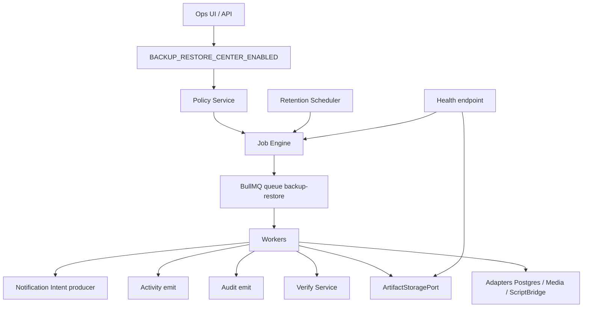

# Phase 43 — Backup & Restore Center Architecture

**Phase:** 43 (Architecture — **APPROVED**)  
**Status:** **ARCHITECTURE APPROVED** · Phase **43a FOUNDATION** in progress / closed per implementation gates · Implementation must follow this SSOT without redesign  
**Prerequisite:** Release **42.0** COMPLETE · FROZEN · tagged `v42.0.0`; Phases **41–42** frozen; Dynamic Platform **28–36**, **38–40** frozen  
**Discovery companion:** [`PHASE_43_ARCHITECTURE_DISCOVERY_AND_READINESS.md`](./PHASE_43_ARCHITECTURE_DISCOVERY_AND_READINESS.md)  
**Foundation developer guide:** [`BACKUP_RESTORE_CENTER_FOUNDATION.md`](./BACKUP_RESTORE_CENTER_FOUNDATION.md)  
**Authoring panel:** CTO · Principal Enterprise SaaS · Healthcare ERP · Platform · Backend · Frontend · Security · Compliance · DevOps  
**SSOT for:** All Backup & Restore Center implementation phases **43a–43g**, Marketplace backup-policy packs (future), Plugin SDK backup adapters (future)

**Numbering note:** Repository SSOTs permanently assign **Phase 43** to **Backup & Restore**. Import/Export Center is Phase **42** (frozen). Phase **37** remains reserved for Department / Franchise hardening — not started here.  
**Authority note:** This document is the permanent Architecture SSOT. Do **not** redesign Phases 28–42. Phase **43a** is foundation only (no execution).

**Related ops foundation (pre-platform):** [`DISASTER_RECOVERY.md`](./DISASTER_RECOVERY.md), [`BACKUP_RESTORE_DRILL_REPORT.md`](./BACKUP_RESTORE_DRILL_REPORT.md), `apps/api/scripts/backup-postgres.*`, `verify-backup.sh`, `restore-postgres.sh`

---

## 1. Executive Summary

Phase 43 defines the **Backup & Restore Center** — an enterprise **business continuity control plane** for the Healthcare ERP. It turns today’s **manual/scripted** Postgres dump + verify + restore path into a **licensed, RBAC-gated, audited, schedulable platform** with job history, encrypted artifacts, retention, integrity verification, restore drills, and production enablement gates.

```
Module Registry (extension kind: backupRestore)
  ↓
EffectiveBackupRestoreView (runtime configuration authority — after 43b)
  ↓
Backup Policy + Job Engine
  ↓
Workers (backup / verify / retain / restore-drill / restore)
  ↓
Artifact Storage (encrypted) + Checksums
  ↓
Consume: Audit · Activity · Notification Intent · Health · Scheduler · RBAC · Licensing
```

### Purpose

Answer, for every authorized operator and every tenant:

> *Is protected data backed up on schedule, verified, retained correctly, and recoverable within agreed RPO/RTO — without bypassing security, and without becoming a second SoR for clinical or financial data?*

### Vision

A production-ready Backup & Restore Center that:

1. Runs **policy-driven** backups (full / incremental where approved).  
2. Stores **encrypted, checksummed** artifacts off primary compute.  
3. **Verifies** integrity automatically.  
4. Supports **restore drills** into isolated targets.  
5. Supports **controlled production restore** under dual-control.  
6. Emits **Activity** (observe), **Notification intents** (notify), **Audit** (prove).  
7. Remains **disabled by default** until operational gates pass.

### Relationship rule (Observe · Notify · Prove · Orchestrate · Protect)

| Layer | Verb | Owner |
|-------|------|-------|
| Activity | Observe | Phase 38 (frozen) |
| Notification | Notify | Phase 41 Intent producer only |
| Audit | Prove | Phase 39 (frozen) |
| Journey / Workflow | Orchestrate | Phase 40 / Workflow (unchanged) |
| Backup & Restore | **Protect / Recover** | Phase 43 |
| Import/Export | Move datasets | Phase 42 (frozen; not DR dumps) |

---

## 2. Scope

### 2.1 In Scope (architecture + future authorized implementation)

1. Backup **policy catalog** (targets, cadence, retention, encryption class, license feature).  
2. **Job orchestration** (states, retries, DLQ, cancel, expiry) on dedicated queue **`backup-restore`**.  
3. **Adapters** for backup targets (Postgres primary in v1; media/file store; optional Redis metadata later).  
4. **Artifact model** (location metadata, checksum, size, encryption envelope, TTL/retention).  
5. **Verify** pipeline (checksum + optional restore-smoke into scratch DB).  
6. **Retention / cleanup** workers.  
7. **Restore drill** mode (non-production target).  
8. **Controlled restore** mode (production — dual-control, audited).  
9. Hub **UI** (policies, jobs, artifacts, drills, health).  
10. Activity + Audit emission; optional Notification intents.  
11. Feature flag `BACKUP_RESTORE_CENTER_ENABLED` (default **false**).  
12. Dynamic Platform extension kind **`backupRestore`** + static catalog baseline.  
13. Compatibility wrappers that invoke existing scripts as **adapters** during migration.  
14. Production enablement gates and ops runbook evolution.

### 2.2 Non-Goals

| Non-goal | Remains owned by |
|----------|------------------|
| Import/Export of business datasets | Phase 42 Import/Export Center |
| Notification delivery engine | Phase 41 |
| Patient / billing / inventory SoR | Domain modules |
| Full multi-region active/active HA product | Future infra program |
| Marketplace runtime loader | Future Marketplace phase |
| Department / franchise hierarchy | Phase 37 |
| Redesign of Media processing pipeline | Media module |
| Replacing DISASTER_RECOVERY policy intent | Evolve docs; do not discard |
| Tenant data deletion / GDPR erase engine | Separate compliance program |
| Point-in-time recovery (WAL) as mandatory v1 | **OD-PITR** — may be 43+ |

### 2.3 Future Scope

- Continuous WAL / PITR managed service integration  
- Cross-region replication orchestration  
- Tenant self-service restore portal (if OD-TENANT approves)  
- Signed Marketplace backup-policy packs  
- Application-consistent snapshots beyond Postgres (object-store versioning sync)

### 2.4 Scope creep prohibition

“Useful download of all patients as CSV” is **Import/Export**, not Backup.  
“Re-seed demo DB” is **not** production restore.  
Any capability outside §2.1 requires an architecture addendum.

---

## 3. Bounded Contexts & Domain Ownership

| Context | Owns | Does not own |
|---------|------|--------------|
| **BackupRestore Center** | Policies, jobs, artifacts metadata, verify/restore orchestration, hub UI | Domain entity truth |
| **Backup Adapter (Postgres)** | How to dump/stream DB for a scope | Schema evolution |
| **Backup Adapter (Media)** | How to snapshot media prefixes | Media processing |
| **Artifact Storage Port** | Put/get/delete encrypted blobs | Business meaning of bytes |
| **Identity / RBAC** | Who may act | Backup schedules |
| **Licensing** | Whether tenant may use feature | Job mechanics |
| **Audit / Activity / Notification** | Prove / observe / notify | Backup SoR |

### Aggregates (logical)

1. **BackupPolicy** — cadence, targets, retention, encryption, enabled flag  
2. **BackupJob** — lifecycle instance of a run  
3. **BackupArtifact** — immutable blob reference + checksum + encryption metadata  
4. **RestoreJob** — drill or controlled restore referencing artifact(s)  
5. **BackupHealthSnapshot** — readiness aggregates (no PHI)

---

## 4. Runtime Architecture



### Job state machine (conceptual)

`queued → running → verifying → succeeded | failed → dead_letter`  
Restore: `queued → approved → running → validating → succeeded | failed`

Cancel and expire rules mirror platform job patterns **without** importing Import/Export Runtime modules.

### Queues

| Queue | Purpose |
|-------|---------|
| `backup-restore` | All backup, verify, retention, restore-drill, restore jobs |

**Never** reuse `notification-delivery` or `import-export` queues for backup bytes.

### Schedulers

| Scheduler | Role |
|-----------|------|
| Policy runner | Enqueues due backups per policy |
| Retention sweeper | Marks expired artifacts → delete after grace |
| Drill reminder | Optional intent when drill overdue |

### Failure strategy

- Retry transient storage/DB lock errors with backoff.  
- Dead-letter permanent failures; alert.  
- Never delete last-known-good artifact on failed successor (retention floor OD).  
- Notification/Activity failures **must not** fail backup success (same pattern as Phase 42).

### Recovery strategy

1. Flag off → stop new jobs.  
2. Re-run verify on latest artifact.  
3. Restore drill to scratch.  
4. Controlled restore only after dual-control approval.  
5. Post-restore validation checklist (tenants count, auth, sample patient read — no PHI in logs).

---

## 5. Extension Model

| Element | Design |
|---------|--------|
| Extension kind | `backupRestore` |
| Static catalog | Parity baseline; **never** runtime authority after Effective view exists |
| Runtime authority | `EffectiveBackupRestoreView` (43b+) |
| Adapters | Register by `providerKey` (e.g. `postgres-logical`, `media-prefix`, `script-bridge`) |
| Marketplace | Future signed policy packs; no redesign of registry schema required |

---

## 6. Data Ownership

| Data | Owner | Store |
|------|-------|-------|
| Policy definitions | Backup Center | Platform DB (tenant-scoped) |
| Job rows | Backup Center | Platform DB |
| Artifact **metadata** | Backup Center | Platform DB |
| Artifact **bytes** | Storage provider via port | Off-host object store / durable volume |
| Encryption keys | KMS / secrets manager (**OD-KMS**) | Never in DB plaintext |
| Domain tables | Domain modules | Primary DB (source of backup) |

Backups are **copies**, not sources of truth, until a controlled restore is explicitly executed.

---

## 7. Security Architecture

### Principles

1. **Fail-closed** when flag off, unlicensed, or unauthorized.  
2. **Least privilege** — separate permissions for view / run backup / download / restore drill / restore prod.  
3. **Encrypt artifacts** at rest (envelope encryption).  
4. **Audit every** create, download, verify, restore approval, restore execute.  
5. **No PHI in logs** — job IDs, checksums, counts only.  
6. **Tenant isolation** — artifacts keyed by tenant; no cross-tenant restore without platform-admin break-glass (**OD-BREAKGLASS**).  
7. **Dual-control** for production restore (requester ≠ approver) unless OD waives for single-admin tenants.

### RBAC (proposed permission keys)

| Permission | Capability |
|------------|------------|
| `backup_restore.policy.read` | View policies |
| `backup_restore.policy.write` | Edit policies |
| `backup_restore.job.read` | View jobs |
| `backup_restore.job.run` | Trigger on-demand backup |
| `backup_restore.artifact.download` | Download artifact |
| `backup_restore.restore.drill` | Execute drill |
| `backup_restore.restore.execute` | Production restore |
| `backup_restore.restore.approve` | Approve production restore |

### Licensing

Plan feature flag / entitlement e.g. `allowBackupRestore`. Unlicensed → hub locked; APIs 403.

### Threat notes

| Threat | Control |
|--------|---------|
| Exfiltration via download | Short-lived tokens, audit, anomaly alerts |
| Ransomware targeting backups | Immutable/WORM retention tier (**OD-WORM**) |
| Accidental prod wipe | Dual-control + confirm target URL allow-list |
| Key compromise | Key rotation procedure; separate backup DEKs |

---

## 8. Platform Integration Architecture

| Platform | Integration mode |
|----------|------------------|
| Notification (41) | Produce intents: `backup_succeeded`, `backup_failed`, `verify_failed`, `restore_completed`, `drill_overdue` — **never** own delivery |
| Activity (38) | Emit observe events for job lifecycle |
| Audit (39) | Emit prove events for policy change, download, restore approve/execute |
| RBAC | Guards on all APIs |
| Licensing | Entitlement check before enable |
| Configuration / Settings | Surface hub under Settings; store non-secret prefs |
| Feature Flags | `BACKUP_RESTORE_CENTER_ENABLED=false` default |
| Scheduler / Background | Register schedulers/workers; respect `BACKGROUND_*` envs |
| Media | Reuse `MediaStoragePort`-like patterns / virus scan **not** required for outbound encrypted dumps; inbound restore packages may scan |
| Import/Export (42) | **No runtime coupling**; conceptual boundary only |
| Health | `GET /backup-restore/health` readiness (no PHI) |
| Monitoring / Observability | Metrics: job success rate, duration, artifact bytes, DLQ, verify failures; correlation IDs on jobs |
| Module Registry | `backupRestore` contributions |

**Rule:** Consume existing platforms. **Do not redesign** them.

---

## 9. Deployment Model

1. Deploy API with module dormant (`BACKUP_RESTORE_CENTER_ENABLED=false`).  
2. Configure storage + KMS credentials.  
3. Migrate Backup Center tables.  
4. Enable workers/schedulers (platform flags).  
5. Verify health `dormant: true`.  
6. Pass production gates (see §11).  
7. Enable flag in pilot.  
8. Run first backup + verify + drill before broad rollout.

### Environment variables (proposed)

| Variable | Default | Purpose |
|----------|---------|---------|
| `BACKUP_RESTORE_CENTER_ENABLED` | `false` | Master switch |
| `BACKUP_RESTORE_ARTIFACT_PATH` / URI | unset | Durable artifact location |
| `BACKUP_RESTORE_ENCRYPTION_KEY_REF` | unset | KMS/key reference |
| `BACKUP_RESTORE_DEFAULT_RETENTION_DAYS` | `30` | Policy default |
| `BACKGROUND_WORKERS_ENABLED` | on | Required when enabled |
| `BACKGROUND_SCHEDULERS_ENABLED` | on | Required when enabled |

---

## 10. Operational Architecture

Evolve [`DISASTER_RECOVERY.md`](./DISASTER_RECOVERY.md) into platform-backed procedures:

| Concern | Approach |
|---------|----------|
| Common failures | Storage unreachable, dump timeout, checksum mismatch, restore target busy |
| Retry | Transient only; DLQ otherwise |
| Dead-letter | Operator replay after fix |
| Artifact cleanup | Retention sweeper; floor of N successful artifacts (**OD-FLOOR**) |
| Notification failures | Non-blocking |
| Storage failures | Fail job; alert |
| Queue / worker failures | Health red; page on-call |
| Support escalation | Platform on-call → security if restore involving PHI breach suspicion |

### Monitoring checklist (mandatory)

Queue depth · worker health · scheduler heartbeats · retry/DLQ counts · verify failure rate · storage errors · API 5xx · authn/authz failures · backup age vs RPO · drill overdue

---

## 11. Production Enablement Gates

Do **not** set `BACKUP_RESTORE_CENTER_ENABLED=true` until:

| # | Gate |
|---|------|
| G1 | Durable encrypted artifact storage configured |
| G2 | Encryption key reference valid and recoverable |
| G3 | Database migrated |
| G4 | Queue healthy |
| G5 | Worker running |
| G6 | Scheduler running |
| G7 | Health green |
| G8 | Monitoring + alerting enabled |
| G9 | Successful backup + verify in pilot |
| G10 | Successful restore **drill** documented |
| G11 | Dual-control restore procedure tested (tabletop OK for v1) |
| G12 | RPO/RTO targets documented (even if aspirational — **OD-RPO/RTO**) |

---

## 12. Implementation Roadmap

### 43a — Foundation

| | |
|--|--|
| **Purpose** | Contracts, constants, flag, permissions stubs, health dormant, static catalog, registry kind |
| **Scope** | Docs-aligned scaffolding only; no real dumps |
| **Deliverables** | Module skeleton, config, health, tests for flag-off |
| **Out of scope** | Workers, storage, UI |
| **Dependencies** | Architecture approval |
| **Acceptance** | Flag default false; health dormant; zero behavior change elsewhere |
| **Review gate** | Owner + security |

### 43b — Job Engine & Policies

| | |
|--|--|
| **Purpose** | Policy CRUD, job state machine, queue wiring |
| **Deliverables** | Prisma models, repositories, queue/worker shell |
| **Out of scope** | Real adapter dumps |
| **Acceptance** | Jobs enqueue/cancel/expire; RBAC enforced |

### 43c — Backup Runtime

| | |
|--|--|
| **Purpose** | Postgres adapter (+ script-bridge compatibility) |
| **Deliverables** | Successful artifact upload path |
| **Out of scope** | Production restore |
| **Acceptance** | On-demand + scheduled backup produces checksummed artifact |

### 43d — Verify & Retention

| | |
|--|--|
| **Purpose** | Integrity verify + retention sweeper |
| **Acceptance** | Tamper detection; expired artifacts deleted per policy |

### 43e — Restore Drill & Controlled Restore

| | |
|--|--|
| **Purpose** | Scratch restore + dual-control prod restore |
| **Acceptance** | Drill succeeds; prod restore audited end-to-end in non-prod simulation |

### 43f — Operations UI

| | |
|--|--|
| **Purpose** | Settings hub for policies/jobs/artifacts/drills/health |
| **Out of scope** | Design-system rewrite |
| **Acceptance** | Playwright smoke; a11y baseline |

### 43g — Production Acceptance

| | |
|--|--|
| **Purpose** | Gates, runbook, enablement docs, smoke |
| **Acceptance** | All gates documented; flag remains false by default; PASS readiness |

---

## 13. Risk Register

| ID | Category | Risk | Mitigation |
|----|----------|------|------------|
| R1 | Security | Artifact exfiltration | Encrypt, RBAC, short-lived URLs, Audit |
| R2 | Security | Unauthorized restore | Dual-control, allow-listed targets |
| R3 | Operational | Silent backup failure | Alerts + intents + health |
| R4 | Performance | Primary DB load | Off-peak windows; optional replica (**OD-REPLICA**) |
| R5 | Migration | Dual script/platform paths | Script-bridge adapter; deprecation plan |
| R6 | Deployment | Lost encryption keys | KMS + documented recovery (**OD-KMS**) |
| R7 | Scalability | Storage cost | Retention tiers; compression |
| R8 | Business | Untested restore | Mandatory drill gate G10 |
| R9 | Recovery | RTO overrun | Measure drills; tune parallelism |
| R10 | Compliance | Backup retains deleted PHI beyond policy | Retention aligned to legal hold ODs |

---

## 14. Open Decisions (unresolved)

| ID | Decision | Options (examples) |
|----|----------|--------------------|
| OD-RPO | Target RPO | 24h / 4h / 1h |
| OD-RTO | Target RTO | 8h / 4h / 1h |
| OD-STORAGE | Artifact backend | Local durable volume / S3-compatible / cloud native backup |
| OD-KMS | Key custody | Env secret / cloud KMS / HSM |
| OD-PITR | WAL PITR in v1 | Defer / include |
| OD-TENANT | Tenant self-service restore | Ops-only / owner self-service drill only / full |
| OD-LICENSE | SKU packaging | All paid plans / enterprise add-on |
| OD-FLOOR | Minimum retained successes | 1 / 3 / 7 |
| OD-WORM | Immutable storage | Required / optional |
| OD-REPLICA | Backup from read replica | Required for large tenants / optional |
| OD-BREAKGLASS | Cross-tenant platform restore | Forbidden / platform-admin only |
| OD-SCOPE | Backup scope v1 | Whole DB / per-tenant logical |
| OD-GIT | Reconcile local `v42.0.0` with any external remote | Owner ops |

**Discovery must not silently resolve these.** Implementation phases bind after owner decisions.

---

## 15. Compatibility with Existing Scripts

| Script | Phase 43 stance |
|--------|-----------------|
| `backup-postgres.sh/.ps1` | Become **ScriptBridgeAdapter** or called by Postgres adapter initially |
| `verify-backup.sh` | Map to Verify Service |
| `restore-postgres.sh` | Map to Restore Drill / Restore adapters |
| `DISASTER_RECOVERY.md` | Remains policy intent; Center becomes execution SSOT for jobs |

No forced deletion of scripts in 43a–43c.

---

## 16. Observability

- Structured logs namespace `backup_restore`  
- Metrics namespace `backup_restore.*`  
- Correlation ID on every job  
- Health exposes: featureFlag, queue, worker, scheduler, lastSuccessAge, lastVerifyStatus, storageConfigured, encryptionConfigured — **no paths that leak secrets**

---

## 17. Architecture Completeness Gate

| Item | Status |
|------|--------|
| Purpose / vision / scope / non-goals | Complete |
| Bounded contexts / ownership / aggregates | Complete |
| Runtime / extension / data / security | Complete |
| Integration with frozen platforms | Complete |
| Ops / gates / roadmap / risks / ODs | Complete |
| Owner approval | **Pending** |
| Implementation | **Not authorized** |

---

## 18. Explicit Statements

- Release **42.0** remains frozen; Import/Export Runtime **unchanged** by this document.  
- Phase **41** remains frozen; consume Notification Intent producer only.  
- Phase **43** implementation **must not** begin before Architecture Review approval.  
- Center remains **disabled by default** in all implementation phases until gates pass.

---

**Document control:** APPROVED 2026-07-18 · Discovery PASS · Phase 43a foundation authorized / implemented as contracts-only
