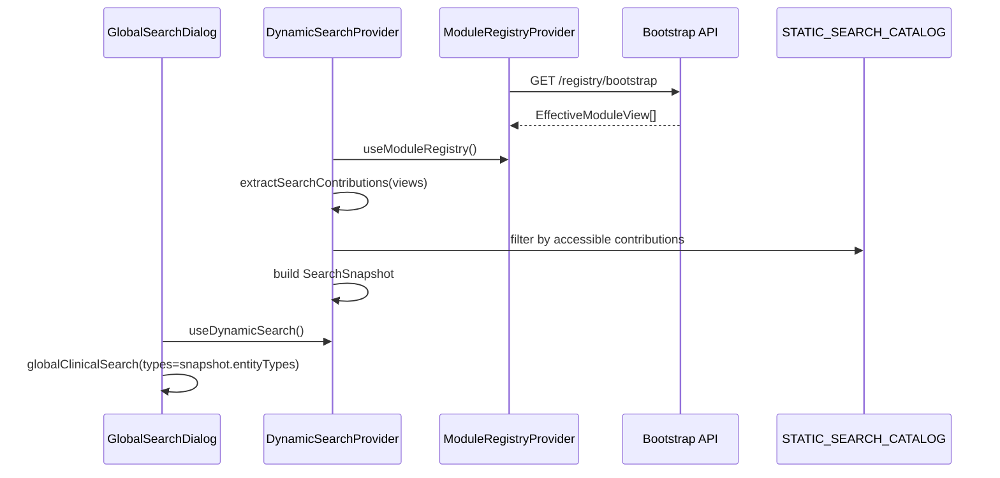

# Phase 32 — Dynamic Search Architecture

**Phase:** 32 (32a **CLOSED** · 32b **CLOSED** 2026-07-13 · 32c **CLOSED** 2026-07-13)  
**Status:** **Phase 32 COMPLETE** — permanent production search foundation  
**Prerequisite:** Phase 31 — Dynamic Dashboard (**permanently closed**, 2026-07-13)  
**Authoring panel:** CTO · Principal Enterprise SaaS · Healthcare ERP · Platform · Backend · Frontend · Security · DevOps  
**SSOT for:** Phase 32 implementation (32a, 32b, 32c), future Marketplace search extensions, Plugin SDK search providers

---

## 1. Executive Overview

### 1.1 Purpose

Phase 32 migrates the **source of searchable metadata** from disconnected static configuration to the Module Registry Effective Module View — without changing search UI, search APIs, indexing, ranking algorithms, or result rendering.

Search becomes the fourth registry consumer (after navigation, routing, and dashboard), following the identical **catalog-as-baseline** pattern proven in Phases 29b–31.

### 1.2 Scope

| In scope | Out of scope |
|----------|--------------|
| Architecture for registry-driven search metadata | Implementation code, stubs, or schema files |
| `SearchContribution` extension schema (design) | Changing `GET /search` contract or response shape |
| Static Search Catalog design | Elasticsearch / external search engine |
| `DynamicSearchProvider` design | Redesigning `GlobalSearchDialog` UI |
| Effective Search View resolution | Changing Prisma repository queries |
| Cache, rollback, security, testing strategy | Modifying Phase 28–31 behavior |
| Phase 32a / 32b / 32c roadmap | Marketplace runtime (future) |

### 1.3 Goals

1. Every licensed module declares searchable entities via manifest `search` extensions.
2. Frontend aggregates **which entity types** a user may search from `EffectiveModuleView` only.
3. Backend continues to execute search via existing `GlobalSearchHandler` and `PrismaGlobalSearchRepository`.
4. Deep-link templates, permission resources, and entity type lists derive from a single Static Search Catalog parity baseline.
5. Independent rollback via `VITE_USE_STATIC_SEARCH_ONLY=true`.
6. Zero licensing duplication, zero RBAC duplication, zero routing duplication.

### 1.4 Non-goals

- Replacing Prisma global search with Elasticsearch (future enhancement).
- Module-internal settings search (`settings-search.ts`) — remains local.
- Dashboard widget filter search — remains local to `DashboardPage`.
- Analytics page filter — remains local.
- Backend provider registry refactor (monolithic repository switch) — deferred to Phase 32c or later unless required for parity.
- Changing `@RequireLicensedModule('search')` or `api.search` permission model.

### 1.5 Migration philosophy

**Change the filter, not the engine.**

```
BEFORE:  search.types.ts + navigateHit() switch + hardcoded types param → API → Prisma
AFTER:   EffectiveModuleView → search contributions → STATIC_SEARCH_CATALOG filter → same API → same Prisma
```

Existing components (`GlobalSearchDialog`, `globalClinicalSearch`, `GlobalSearchHandler`) are preserved. Only the **metadata source** for allowed entity types and deep links changes.

Rollback restores the current static path instantly with no code deploy.

---

## 2. High-Level Architecture

### 2.1 Component diagram

```mermaid
flowchart TB
  subgraph Server["Server (authoritative)"]
    LE[LicensingEngineService]
    RBAC[Permission Matrix + Guards]
    MR[ModuleRegistryService]
    EMV[EffectiveModuleView[]]
    LE --> MR
    RBAC --> MR
    MR --> EMV
    API[GET /search — unchanged]
    PRISMA[PrismaGlobalSearchRepository — unchanged]
    API --> PRISMA
  end

  subgraph Client["Clinic Dashboard"]
    BOOT[Bootstrap API]
    MRP[ModuleRegistryProvider]
    DSP[DynamicSearchProvider]
    CAT[STATIC_SEARCH_CATALOG]
    RES[search-resolver.ts]
    CACHE[search-cache.ts]
    UI[GlobalSearchDialog — unchanged]
    SAPI[search-api.ts — unchanged]

    BOOT --> MRP
    MRP --> EMV
    EMV --> DSP
    CAT --> DSP
    RES --> DSP
    CACHE --> DSP
    DSP --> UI
    UI --> SAPI
    SAPI --> API
  end
```

### 2.2 Component responsibilities

| Component | Role | Changes in Phase 32 |
|-----------|------|----------------------|
| **Module Registry** | Authoritative manifest + Effective Module View | None — already emits `kind: 'search'` extensions |
| **EffectiveModuleView** | Server-projected module + extension accessibility | None — consumer only |
| **Static Search Catalog** | Parity baseline (**26 executable + 9 discovery**) | **Implemented (32a)** — `STATIC_SEARCH_CATALOG` |
| **Search Resolver** | Extract + filter contributions → snapshot | **New** |
| **DynamicSearchProvider** | Build snapshot, cache, fallback | **Implemented (32b)** |
| **GlobalSearchDialog** | UI, debounce, keyboard nav | **Integrated (32b)** — reads `typesParam` from provider |
| **search-api.ts** | `GET /search` client | **Unchanged** — `types` string from provider |
| **GlobalSearchHandler** | RBAC filter, cache, rank | **Unchanged** |
| **PrismaGlobalSearchRepository** | Per-type queries | **Unchanged** |

### 2.3 Data flow (runtime)

```
Bootstrap GET /tenant/modules/registry/bootstrap
  → EffectiveModuleView[] (license ∩ flags ∩ RBAC ∩ deps)
  → DynamicSearchProvider
  → extractSearchContributions(views)
  → filter STATIC_SEARCH_CATALOG by extension userAccessible
  → SearchSnapshot { entityTypes[], deepLinkTemplates, source }
  → GlobalSearchDialog passes entityTypes to globalClinicalSearch()
  → GET /search?types=... (backend re-validates RBAC — authoritative)
  → results rendered (unchanged)
```

---

## 3. Search Manifest Extensions

### 3.1 Current schema (`SearchContribution`)

Defined in `packages/module-registry/src/types.ts`. Phase 32a **implemented** `searchScope` and `discoveryKey`:

```typescript
interface SearchContribution extends ExtensionBase {
  extensionId: string;              // "{moduleId}/search/{localId}"
  labelKey: string;
  sortOrder: number;
  entityType: string;                 // canonical SearchEntityType OR discovery key
  permissionResources: string[];
  deepLinkTemplate: string;
  backendProviderKey?: string;
  searchScope: 'executable' | 'discovery';
  discoveryKey?: string;            // discovery-only; never sent to GET /search types
  deprecatedAliases?: string[];
}
```

### 3.2 Extended schema (future — not in 32a)

```typescript
interface SearchContribution extends ExtensionBase {
  // ── Identity ──
  extensionId: string;              // "{moduleId}/search/{localId}"
  labelKey: string;                   // i18n label for admin/discovery UI
  sortOrder: number;

  // ── Entity binding ──
  entityType: string;                 // canonical SearchEntityType (e.g. "patient")
  entityTypes?: string[];             // optional multi-type binding (e.g. dental module → 6 types)
  moduleId?: LicensedModuleId;        // redundant guard; must match manifest moduleId

  // ── Authorization (server-projected) ──
  resourceId?: string;                // primary RBAC resource
  permissionResources: string[];      // all resources required (OR semantics at API layer today)

  // ── Licensing ──
  featureId?: string;                 // optional plan feature gate
  minimumPlan?: PlanTier;             // optional plan floor

  // ── Navigation ──
  deepLinkTemplate: string;           // "/patients/{id}" — {query}, {id} placeholders
  quickActionPath?: string;           // optional Cmd+K quick action route

  // ── Discovery metadata ──
  category?: SearchCategory;          // clinical | operations | financial | platform | admin
  icon?: string;                      // lucide icon key
  keywords?: string[];                // admin filter / future SEO
  hidden?: boolean;                   // exclude from discovery UI

  // ── Execution (backend) ──
  backendProviderKey?: string;        // "search.patients" — future provider registry
  searchStrategy?: 'prisma' | 'provider' | 'external';  // default: prisma

  // ── Ranking hints (client metadata only — server ranker unchanged in 32a/32b) ──
  rankingWeight?: number;             // 0–100, default 50
  boostExactMatch?: boolean;          // hint for future ranker

  // ── Filters ──
  supportedFilters?: string[];        // branchId, status, dateRange — future
  defaultLimit?: number;              // per-entity default page size hint

  // ── Localization ──
  resultTitleKey?: string;            // optional i18n for result template
  resultSubtitleKey?: string;

  // ── Result template (future) ──
  resultTemplateKey?: string;         // "search.result.patient" — Phase 32c+
}
```

### 3.3 Canonical entity vocabulary

**Authoritative source (implemented):** `packages/module-registry/src/search/canonical-search-entities.ts`

Aligned with `apps/api/src/modules/search/domain/search.types.ts` — **26 executable** `SearchEntityType` values:

| Category | Entity types (26 executable) |
|----------|-------------------------------|
| Identity | `user` |
| Patients | `patient` |
| Scheduling | `appointment` |
| Clinical | `encounter`, `diagnosis`, `problem`, `care_plan`, `note_template`, `lab_result` |
| Dental | `dental_plan`, `dental_ortho`, `dental_implant`, `dental_note`, `dental_image` |
| Beauty | `beauty_plan`, `beauty_session`, `beauty_consultation`, `beauty_image` |
| Billing | `invoice`, `treatment` |
| Inventory | `inventory` |
| Reporting | `report` |
| Notifications | `notification` |
| Workflow | `workflow`, `workflow_task`, `workflow_template` |

**Alignment rule:** Manifest `entityType` MUST use canonical `SearchEntityType` values for `searchScope: 'executable'`. Coarse placeholders (`dentalRecord`, `queueTicket`, `inventoryItem`) are **deprecated** — aliases recorded in canonical metadata; manifests migrated in 32a.

### 3.3.1 Executable vs discovery taxonomy (32a)

| Scope | Count | Contributes to GET /search `types` | Source |
|-------|-------|-------------------------------------|--------|
| **executable** | **26** | **Yes** | `canonical-search-entities.ts` |
| **discovery** | **9** | **No** | `canonical-discovery-search.ts` |

Discovery keys: `dashboard`, `analytics-metric`, `ai-prompt`, `setting`, `global`, `portal-appointment`, `media-asset`, `commission-rule`, `loyalty-program`.

Integrity rule: `validateBuiltinSearchIntegrity()` rejects discovery contributions that use executable `SearchEntityType` values and rejects queue entity types.

### 3.3.2 Queue search strategy (32a decision)

**Strategy B — excluded.** `QUEUE_SEARCH_STRATEGY = 'excluded'` in `canonical-discovery-search.ts`. Queue module has **no** search manifest extensions. Queue navigation remains via routing/navigation only. No backend `SearchEntityType` for queue tickets.

### 3.4 Multi-entity modules

Modules like `dental` and `beauty` declare **one extension per entity type** (not one coarse extension):

```
dental/search/dental-plan     → entityType: dental_plan
dental/search/dental-ortho    → entityType: dental_ortho
...
```

The `search` licensed module retains a `global` meta-extension for the search page itself.

---

## 4. Search Catalog

### 4.1 Why it exists

Mirrors `STATIC_ROUTE_CATALOG` (Phase 30) and `STATIC_DASHBOARD_CATALOG` (Phase 31):

- **Parity baseline** — proves registry mode matches legacy static behavior.
- **Rollback surface** — static fallback does not read manifests.
- **Validation anchor** — integrity tests compare manifest contributions against catalog entries.
- **Rendering SSOT** — deep links, permission resources, and entity types in one place.

### 4.2 `STATIC_SEARCH_CATALOG` structure (design)

**Location:** `apps/clinic-dashboard/src/features/dynamic-search/lib/static-search-catalog.ts`

```typescript
interface SearchCatalogEntry {
  entityType: SearchEntityType;
  moduleId: LicensedModuleId;
  resourceId: string | string[];       // from SEARCH_ENTITY_PERMISSION_RESOURCES
  deepLinkTemplate: string;              // derived from SEARCH_ENTITY_URLS
  backendProviderKey: string;            // search.{moduleId}
  category: SearchCategory;
  sortOrder: number;
  rankingWeight?: number;
  labelKey?: string;
}
```

**Entry count:** **35** total — **26 executable** + **9 discovery** (generated from canonical registry vocabulary).

### 4.3 Parity maintenance

| Check | Mechanism |
|-------|-----------|
| Catalog ↔ backend types | Vitest: every `SearchEntityType` has catalog entry |
| Catalog ↔ manifests | `validateBuiltinSearchIntegrity()` in module-registry |
| Registry ↔ static (per role) | `verifySearchParity()` — allowed types list equality |
| Client ↔ API | Playwright: search results respect role permissions |

### 4.4 Migration strategy

1. **32a:** ✅ `canonical-search-entities.ts` + `canonical-discovery-search.ts` + `STATIC_SEARCH_CATALOG`.
2. **32a:** ✅ Builtin manifests expanded from 21 coarse extensions → **35** fine-grained extensions (queue excluded).
3. **32b:** Wire `DynamicSearchProvider` — `types` param from snapshot.
4. **32b:** Remove hardcoded `types` default string from `search-api.ts` (read from provider).
5. **32c:** Deprecate `navigateHit()` switch — prefer `hit.url` from API (already primary).
6. **Future:** Backend provider registry per `backendProviderKey`.

---

## 5. Effective Search View

### 5.1 Definition

The **Effective Search View** is the client-side projection:

```
EffectiveSearchView = {
  entityTypes: SearchEntityType[];      // ordered, deduplicated
  entries: SearchCatalogEntry[];        // filtered catalog rows
  deepLinkTemplates: Map<SearchEntityType, string>;
  source: 'registry' | 'static-fallback';
  catalogGeneration: number | null;
  entitlementVersion: string | null;
}
```

### 5.2 Resolution

```
EffectiveModuleView[]
  → for each extension where kind === 'search'
  → payload must include entityType + userAccessible (server-projected)
  → match against STATIC_SEARCH_CATALOG entry by entityType
  → include if extension.userVisible && extension.userAccessible
  → core/search module types always gated by api.search license
```

### 5.3 How modules become searchable

A module is searchable when **all** of the following are true:

1. Module licensed (`licenseState !== 'hidden'`).
2. Module not tenant-disabled (`moduleFlags`).
3. Dependency health acceptable (required deps licensed).
4. Extension `userAccessible === true` (RBAC projected server-side).
5. Matching `SearchCatalogEntry` exists in `STATIC_SEARCH_CATALOG`.

The client **never** re-evaluates licensing or RBAC for inclusion — it trusts `userAccessible` flags from bootstrap, identical to dashboard widget gating.

---

## 6. Search Resolution Flow

### 6.1 Bootstrap → snapshot



### 6.2 Filters applied (in order)

| Stage | Filter | Authority |
|-------|--------|-----------|
| 1 | License projection | Server (bootstrap) |
| 2 | Tenant module flags | Server |
| 3 | Dependency health | Server |
| 4 | RBAC per extension | Server (`userAccessible`) |
| 5 | Catalog membership | Client (parity baseline) |
| 6 | Rollback flag | Client (`VITE_USE_STATIC_SEARCH_ONLY`) |
| 7 | API request types param | Client sends; server re-filters |
| 8 | `SearchPermissionFilterService` | Server (authoritative) |
| 9 | Result URLs | Server (`SEARCH_ENTITY_URLS`) |

### 6.3 Ranking

Phase 32 does **not** change ranking. `SearchRankerService` remains authoritative. Client `rankingWeight` in catalog is metadata for future use only.

### 6.4 Result projection

Results remain `GlobalSearchHit[]` from API. Client deep-link fallback (`navigateHit()`) is phased out in 32c when all hits include `url`.

---

## 7. Search Provider

### 7.1 `DynamicSearchProvider` (design)

**Location:** `apps/clinic-dashboard/src/features/dynamic-search/context/DynamicSearchProvider.tsx`  
**Scope:** Wraps `GlobalSearchProvider` / `AppShell` (app-wide, like navigation — search is global).

### 7.2 Context value

```typescript
interface DynamicSearchContextValue {
  snapshot: SearchSnapshot;
  entityTypes: SearchEntityType[];
  typesParam: string;                   // comma-separated for API
  isRegistrySource: boolean;
  isLoading: boolean;
  error: Error | null;
}
```

### 7.3 Hook

```typescript
function useDynamicSearch(): DynamicSearchContextValue;
```

Consumed by `GlobalSearchDialog` (and optionally `useAiCommandPatientLookup` for type scoping).

### 7.4 Provider algorithm

1. `assertSearchCatalogValid(STATIC_SEARCH_CATALOG)` at module load.
2. If `!isRegistrySearchEnabled()` → static snapshot from catalog + `hasPermission` (rollback only).
3. If registry error → static snapshot (`includeAllPermitted` + `hasPermission`; rollback path only).
4. If registry loading with no modules yet → **fail-closed registry snapshot** (never widens search surface):
   - Prefer **last known registry snapshot** for the current identity (in-memory ref).
   - Else **identity-matched search cache** (`readSearchCacheForIdentity`).
   - Else **fresh registry bootstrap cache** (`readRegistryCache` → `buildRegistrySearchSnapshot`).
   - Else **`buildRestrictedSearchSnapshot()`** — empty `typesParam`, `canSearch: false`.
5. If registry loaded → `buildRegistrySearchSnapshot(views, catalog)`.
6. Cache snapshot; store last-known registry snapshot; return via context.

Static `hasPermission` filtering is **never** used during registry-mode bootstrap loading.

### 7.5 Identity / tenant / entitlement refresh

| Event | Action |
|-------|--------|
| Login | Clear search cache; rebuild from bootstrap |
| Logout | Clear search cache |
| Tenant switch | Clear search cache + registry cache |
| Role change | Clear search cache (rolesHash dimension) |
| Entitlement refresh | Rebuild if `entitlementVersion` changes |
| Registry refresh | Rebuild snapshot; compare parity |

Integrated via `clearModuleRegistryCaches()` → `clearSearchCache()`.

---

## 8. Search Cache

### 8.1 Model

In-memory only (matches dashboard/routing/nav pattern — not sessionStorage).

### 8.2 Cache key dimensions

```
search:{tenantId}:{userId}:{rolesHash}:{catalogGeneration}:{entitlementVersion}:{moduleCount}:{source}
```

### 8.3 TTL

No time-based TTL for metadata snapshot (identity-bound invalidation only). Search **results** remain Redis-cached server-side (60s) — unchanged.

### 8.4 Invalidation triggers

- `clearSearchCache()` on logout, tenant switch, role change
- Called from `clearModuleRegistryCaches()` alongside nav/route/dashboard
- Registry bootstrap version bump

### 8.5 Memory model

Single snapshot per cache key. No cross-tenant or cross-user leakage (verified in Playwright acceptance).

---

## 9. Security Model

### 9.1 Principles

| Principle | Implementation |
|-----------|----------------|
| **Fail closed** | Unknown entity type → excluded from snapshot |
| **Server authoritative** | API `SearchPermissionFilterService` re-filters types |
| **No client bypass** | Client snapshot is UX optimization only |
| **Tenant isolation** | Bootstrap scoped to tenant; API enforces `tenantId` |
| **Hidden modules** | `userVisible: false` → extensions excluded |
| **Hidden entities** | No catalog entry → never included |
| **Hidden results** | Server filters hits post-query |
| **Hidden actions** | Quick actions gated by same extension flags |

### 9.2 Licensing

`@RequireLicensedModule('search')` on `GET /search` — unchanged.  
Per-entity licensing implied by module license state in Effective Module View.

### 9.3 RBAC

Extension `userAccessible` from bootstrap. Static rollback uses `hasPermission` (rollback path only — same as dashboard).

### 9.4 Threat model notes

- Direct API call with unauthorized types → server rejects/filters.
- Client tampering `types` param → server permission filter applies.
- Cross-tenant cache → prevented by tenantId in cache key.

---

## 10. Performance

| Concern | Design |
|---------|--------|
| Bootstrap payload | Search extensions already in bootstrap — no new API |
| Lazy metadata | Snapshot built once per identity; memoized |
| Caching | Client in-memory snapshot; server Redis results (60s) |
| Ranking | Server-side only |
| Memory | One snapshot (~2KB) per active identity |
| Search latency | Unchanged — same Prisma queries |
| Scalability | Hundreds of modules: O(extensions) filter; catalog size fixed (~27–200 entries) |

### 10.1 Bootstrap size impact

Expanding manifests from 21 → ~35 search extensions adds ~3–5KB gzip to bootstrap — acceptable. Future: extension pagination if catalog exceeds 500 entries (not Phase 32).

---

## 11. Extension Model

### 11.1 Built-in modules

`buildSearchContributionsForModule(moduleId)` — mirrors `buildDashboardContributionsForModule()` from Phase 31.

### 11.2 Marketplace (future)

Third-party manifests declare `search` extensions in submission bundle. Validation:

- `entityType` registered in canonical catalog OR marketplace namespace (`plugin.{id}.{entity}`)
- `backendProviderKey` maps to registered NestJS provider
- `deepLinkTemplate` validated against route catalog

### 11.3 Plugin SDK (future)

```typescript
registerSearchProvider({
  entityTypes: ['custom_entity'],
  provider: CustomSearchProvider,
  contribution: SearchContribution,
});
```

SDK registers provider at module init; manifest declares metadata. Runtime merges into Effective Search View after server validation.

---

## 12. Dependency Resolution

### 12.1 Module dependencies

If module `dental` has optional dependency on `emr` and `emr` is unlicensed:
- `dental` search extensions remain if `dental` licensed (optional dep degraded, not blocked).
- Required dependency missing → module `lockReason` set → all extensions `userAccessible: false`.

### 12.2 Search provider dependencies

`backendProviderKey` references a NestJS provider. If provider not registered:
- Phase 32a/32b: entity type excluded from client snapshot; API returns empty for that type.
- Phase 32c+: health probe marks extension `degraded`.

### 12.3 Conflicts

Duplicate `entityType` across modules → **rejected at manifest validation** (one canonical owner per entity type, like dashboard widget IDs).

### 12.4 Disabled / blocked modules

`userAccessible: false` on all extensions → zero types in snapshot for that module.

---

## 13. State Machine

### 13.1 Module search lifecycle

```
UNREGISTERED → REGISTERED → LICENSED → ACCESSIBLE → SEARCHABLE
                  ↓              ↓           ↓
              REJECTED      HIDDEN      RBAC_DENIED
```

`SEARCHABLE` = licensed + visible + accessible + catalog entry exists.

### 13.2 Search provider lifecycle (client metadata)

```
STATIC_FALLBACK → REGISTRY_LOADING → REGISTRY_ACTIVE
        ↑                  ↓                ↓
        └──── REGISTRY_ERROR / ROLLBACK_FLAG
```

### 13.3 Bootstrap lifecycle

Aligned with `ModuleRegistryProvider` states — search provider is a subscriber, not a separate bootstrap.

### 13.4 Failure recovery

| Failure | Recovery |
|---------|----------|
| Bootstrap timeout | Static catalog fallback |
| Invalid manifest | Server excludes module; client static fallback |
| API search error | UI error state (unchanged) |
| Rollback flag | Static catalog only |

---

## 14. Event Architecture

### 14.1 Registry events (existing)

Search provider listens to registry refresh completion — rebuilds snapshot.

### 14.2 Proposed search events (design — client only)

| Event | Payload | Action |
|-------|---------|--------|
| `search.snapshot.built` | `{ source, entityCount }` | Diagnostics |
| `search.cache.cleared` | `{ reason }` | Telemetry |
| `search.parity.mismatch` | `{ expected, actual }` | Dev/test only |

### 14.3 Cache invalidation

Centralized in `clear-registry-caches.ts`:

```typescript
clearModuleRegistryCaches(reason) {
  clearRegistryCache();
  clearNavigationCache();
  clearRouteCache();
  clearDashboardCache();
  clearSearchCache();    // Phase 32
}
```

### 14.4 Manifest updates

Hot reload not supported. Bootstrap refresh on entitlement change or manual `registry.refresh()`.

---

## 15. Rollback Strategy

### 15.1 Flag

```
VITE_USE_STATIC_SEARCH_ONLY=true
```

Independent of `VITE_USE_STATIC_NAV_ONLY`, `VITE_USE_STATIC_ROUTES_ONLY`, `VITE_USE_STATIC_DASHBOARD_ONLY`.

### 15.2 Behavior

| Flag | Source | Types param |
|------|--------|-------------|
| `false` (default) | Registry-filtered catalog | From `SearchSnapshot` |
| `true` | `STATIC_SEARCH_CATALOG` + `hasPermission` | Legacy static path |

### 15.3 Playwright rollback

Dedicated webServer on port **5175** (proposed) with rollback flag — mirrors dashboard port 5174 pattern.

### 15.4 Recovery

Toggle env flag → rebuild → instant revert. No database migration. No API deployment coupling.

---

## 16. Testing Strategy

### 16.1 Unit tests

| Suite | Location | Scenarios |
|-------|----------|-----------|
| `search-parity.spec.ts` | module-registry | Manifest ↔ catalog integrity (**12 tests**) |
| `canonical-search-entities` | module-registry | 26 executable types, no duplicates |
| `dynamic-search-foundation.spec.ts` | clinic-dashboard | Catalog generation + validation (**6 tests**) |

### 16.2 Integration tests

- Bootstrap API returns search extensions with correct `userAccessible` per role.
- `GET /search` types param matches snapshot for owner vs receptionist.

### 16.3 Parity tests

```
buildStaticSearchSnapshot(roles) === buildRegistrySearchSnapshot(roles, views, catalog)
```

For roles: owner, receptionist, doctor, dentist, accountant, inventory_manager, patient.

### 16.4 Playwright (`e2e/dynamic-search.spec.ts` — proposed)

| Group | Scenarios |
|-------|-----------|
| Role search | Owner, receptionist, doctor — result visibility |
| Licensing | Expired, suspended, starter plan — type restriction |
| Cache | Tenant switch, logout/login, role change |
| Security | Hidden types never queried |
| Rollback | Port 5175 static parity |
| UX | Cmd+K, debounce, keyboard nav (unchanged) |
| API | No duplicate search requests |

**Target:** 25–30 scenarios (parity with dashboard suite).

### 16.5 Performance

- Snapshot build < 5ms
- No duplicate `/search` calls on dialog open
- No type list flash on load

### 16.6 Acceptance gate

Phase 32 closes when Playwright suite green + parity tests green + SSOT updated — same bar as Phase 31.

---

## 17. Risks

### Critical

| Risk | Mitigation |
|------|------------|
| Entity type vocabulary mismatch breaks search | Canonical catalog + manifest migration in 32a before provider wiring |
| Client-only authorization bypass | Server `SearchPermissionFilterService` remains authoritative; tested in Playwright |

### High

| Risk | Mitigation |
|------|------------|
| `navigateHit()` switch diverges from API URLs | Phase 32c: mandate `hit.url` from API; deprecate switch |
| 21 → 35 manifest extensions break bootstrap | Size audit; lazy extension loading in future |
| Static/API/catalog triple maintenance during migration | Single `canonical-search-entities.ts` generates all three |

### Medium

| Risk | Mitigation |
|------|------------|
| AI patient lookup uses hardcoded types | Wire to `useDynamicSearch()` in 32b |
| Queue entity not in backend search types | **Resolved 32a** — Strategy B: queue excluded from global search |
| Settings local search confusion | Document boundary; no scope creep |

### Low

| Risk | Mitigation |
|------|------------|
| Ranking weights unused in 32a/32b | Document as future; no false dependency |
| Marketplace entity namespaces | Prefix convention `plugin.{id}.*` |

---

## 18. Technical Debt

### Expected (accepted)

| Item | Phase | Notes |
|------|-------|-------|
| Monolithic Prisma search repository | 32c+ | Provider registry per `backendProviderKey` |
| `navigateHit()` client switch | 32c | Remove when API always returns `url` |
| No Elasticsearch | Future | Prisma sufficient for current scale |
| Coarse manifest migration | **32a closed** | 35 manifest search extensions; queue excluded |
| Settings/dashboard local search | Permanent | Intentionally out of scope |

### Marketplace / Plugin SDK

Search provider registration API designed but not implemented until marketplace phase.

---

## 19. Architecture Decisions

| # | Decision | Rationale | Rejected alternative |
|---|----------|-----------|---------------------|
| AD-32-01 | Catalog-as-baseline (same as 30–31) | Proven parity + rollback | Registry-only (no static catalog) |
| AD-32-02 | Client filters metadata only; API executes search | Security, unchanged backend | Client-side search execution |
| AD-32-03 | `canonical-search-entities.ts` in module-registry | Single vocabulary like dashboard widgets | Duplicate types in FE and BE |
| AD-32-04 | One extension per entity type | Aligns with backend `SearchEntityType` | One coarse extension per module |
| AD-32-05 | `DynamicSearchProvider` at AppShell scope | Search is global (Cmd+K) | Page-scoped provider |
| AD-32-06 | Independent `VITE_USE_STATIC_SEARCH_ONLY` | Per-surface rollback | Combined rollback flag |
| AD-32-07 | No backend changes in 32a/32b | Minimize risk | Immediate provider registry refactor |
| AD-32-08 | `types` param remains comma-separated string | API contract frozen | New POST search endpoint |
| AD-32-09 | Server ranking unchanged | Scope control | Client-side ranking |
| AD-32-10 | Fail closed on unknown entity types | Security | Permissive include |
| AD-32-11 | Executable vs discovery `searchScope` | Discovery never pollutes GET /search types | Single undifferentiated extension list |
| AD-32-12 | Queue excluded from global search (Strategy B) | No backend SearchEntityType exists | Add `queue_ticket` backend type |

---

## 20. Phase Roadmap

### Phase 32a — Canonical Vocabulary & Manifest Alignment — **CLOSED 2026-07-13**

**Goal:** Single entity type SSOT; manifests declare all 26 executable + 9 discovery contributions.

| Deliverable | Location | Status |
|-------------|----------|--------|
| `canonical-search-entities.ts` | `packages/module-registry/src/search/` | ✅ |
| `canonical-discovery-search.ts` | `packages/module-registry/src/search/` | ✅ |
| `build-search-contributions.ts` | `packages/module-registry/src/search/` | ✅ |
| `validate-search-integrity.ts` | `packages/module-registry/src/search/` | ✅ |
| `api-search-parity.ts` | `packages/module-registry/src/search/` | ✅ |
| `STATIC_SEARCH_CATALOG` | `apps/clinic-dashboard/src/features/dynamic-search/lib/` | ✅ |
| `search-validation.ts` | `apps/clinic-dashboard/src/features/dynamic-search/lib/` | ✅ |
| Expanded builtin manifest search extensions | `builtin-manifests.ts` | ✅ 35 contributions |
| `search-parity.spec.ts` | `packages/module-registry/src/parity/` | ✅ 12 tests |
| `dynamic-search-foundation.spec.ts` | `apps/clinic-dashboard/src/features/dynamic-search/` | ✅ 6 tests |

**Exit criteria met:** Module-registry **48/48** tests green; clinic-dashboard foundation **5/5**; API module-registry **5/5**; regression suites (dashboard/routing/navigation) **43/43** green. **No UI or backend search behavior changes.**

**Generation pipeline:** `build-search-contributions.ts` derives manifest contributions from canonical entities; `STATIC_SEARCH_CATALOG` derives from the same canonical sources. API `search.types.ts` parity validated via `assertApiSearchEntityParity()` (read-only reference in `api-search-parity.ts` — backend remains runtime authority until optional 32c sync).

### Phase 32b — Dynamic Search Provider & Client Integration — **CLOSED 2026-07-13**

**Goal:** Registry-driven `types` param; static fallback + rollback.

| Deliverable | Location | Status |
|-------------|----------|--------|
| `DynamicSearchProvider` + `useDynamicSearch()` + `useOptionalDynamicSearch()` | `features/dynamic-search/context/` | ✅ |
| `search-resolver.ts` | `features/dynamic-search/lib/` | ✅ |
| `search-snapshot-builder.ts` | `features/dynamic-search/lib/` | ✅ incl. `buildRestrictedSearchSnapshot()` |
| `search-cache.ts` | `features/dynamic-search/lib/` | ✅ incl. `readSearchCacheForIdentity()` |
| `search-types.ts` | `features/dynamic-search/lib/` | ✅ |
| `VITE_USE_STATIC_SEARCH_ONLY` | `static-search-flags.ts` | ✅ |
| `GlobalSearchDialog` integration | reads `typesParam` + `canSearch` from provider | ✅ |
| `search-api.ts` — no hardcoded types | required `types` param | ✅ |
| `resourceIds[]` on catalog entries | `static-search-catalog.ts` | ✅ |
| `clearSearchCache()` | `clear-registry-caches.ts` | ✅ |
| `dynamic-search.spec.ts` | clinic-dashboard | ✅ 22 tests |

**Exit criteria met:** Dynamic-search **28/28**; clinic-dashboard regression **76/76**; module-registry **48/48**; API registry **5/5**. Hardcoded runtime type list eliminated. Owner/general_manager registry ↔ static parity green. Registry loading is fail-closed (no static RBAC widening).

### Phase 32c — Runtime Acceptance & Debt Reduction — **CLOSED 2026-07-13**

**Goal:** Production acceptance; Playwright; documentation closure.

| Deliverable | Location | Status |
|-------------|----------|--------|
| `e2e/dynamic-search.spec.ts` | 31 Playwright scenarios | ✅ |
| `e2e/helpers/dynamic-search.ts` | Search E2E helpers | ✅ |
| Playwright rollback server (port **5175**) | `playwright.config.ts` (`VITE_USE_STATIC_SEARCH_ONLY`) | ✅ |
| `navigateHit()` → catalog deep links | `resolve-search-hit-url.ts` + `GlobalSearchDialog.tsx` | ✅ |
| `useAiCommandPatientLookup` integration | `resolve-entity-types-param.ts` | ✅ |
| Diagnosis search SQL fix (runtime verification) | `prisma-global-search.repository.ts` | ✅ |
| SSOT documentation closure | docs/ | ✅ |

**Exit criteria met:** Playwright **31/31**; dynamic-search vitest **32/32**; clinic-dashboard regression **80/80**; module-registry **48/48**; API registry **5/5**. Phase 32 permanently closed.

**SEARCH_ENTITY_URLS:** Backend map retained as API response authority; client uses `deepLinkByEntityType` from registry catalog. Full codegen sync deferred to **Phase 33** (requires coordinated API release).

---

## 21. Independent Architecture Review

### 21.1 Enterprise-grade?

**Yes.** Follows established registry consumer pattern with server-authoritative security, fail-closed defaults, independent rollback, and comprehensive test strategy.

### 21.2 Scale to hundreds of modules?

**Yes.** Client filters a fixed catalog against O(extensions) bootstrap payload. Extension pagination deferred until >500 search extensions.

### 21.3 Marketplace fit?

**Natural.** Manifest `search` extensions + `backendProviderKey` + SDK `registerSearchProvider()` mirror dashboard widget contributions.

### 21.4 Plugin SDK fit?

**Natural.** Same extension model; SDK registers runtime provider, manifest declares metadata.

### 21.5 Licensing duplicated?

**No.** Server projects license state into `userAccessible`. Client reads flags only.

### 21.6 RBAC duplicated?

**No** in registry mode. Static rollback uses `hasPermission` (intentional, rollback-only).

### 21.7 Routing duplicated?

**No.** Deep links reference routes; routing catalog unchanged.

### 21.8 Dashboard logic duplicated?

**No.** Independent catalog and provider.

### 21.9 Simpler than alternatives?

**Yes.** Alternative (registry-only, no static catalog) failed parity in Phases 30–31. Alternative (rewrite search backend) is higher risk with no user benefit in Phase 32.

### 21.10 Maintainable for 5+ years?

**Yes** — with canonical entity catalog, integrity tests, and catalog-as-baseline pattern.

### 21.11 Architecture readiness score

| Dimension | Score |
|-----------|-------|
| Completeness | **95%** — backend provider registry detail deferred to 32c+ |
| Consistency with Phases 29–31 | **100%** |
| Security model | **95%** |
| Test strategy | **90%** — Playwright scenarios designed, not executed |
| Marketplace readiness | **85%** — designed, not implemented |
| **Overall readiness for implementation** | **92%** |

### 21.12 Remaining architectural risks (post-32a)

1. **Queue entity gap** — **Closed 32a** (Strategy B: excluded from global search).
2. **Bootstrap size growth** — monitor when marketplace adds extensions.
3. **Backend provider registry timing** — defer vs. accumulate monolithic debt.
4. **API URL/deep-link drift** — canonical templates validated in 32a; runtime `SEARCH_ENTITY_URLS` still separate until optional sync.

---

## 22. References

| Document | Relationship |
|----------|--------------|
| `docs/DYNAMIC_MODULE_MANAGEMENT_ARCHITECTURE.md` | Parent architecture; §9.9 search flow |
| `docs/DYNAMIC_SEARCH_ARCHITECTURE.md` | **This document** — Phase 32 SSOT |
| `apps/api/src/modules/search/domain/search.types.ts` | Current backend entity SSOT |
| `packages/module-registry/src/types.ts` | `SearchContribution` schema |
| `packages/module-registry/src/search/` | Canonical vocabulary + builders + integrity (32a SSOT) |
| Phase 31 dashboard patterns | Template for catalog/provider/cache |

---

## 23. Phase 32a Closure Record (2026-07-13)

### Architecture Gate observations — closure status

| # | Observation | Resolution |
|---|-------------|------------|
| 1 | Single `primary` extension per module | ✅ `localId` + `extensionId: {moduleId}/search/{localId}`; multi-entity modules supported |
| 2 | Documented 27 vs backend 26 | ✅ Canonical count frozen at **26 executable** everywhere |
| 3 | No executable vs discovery taxonomy | ✅ `searchScope` + `canonical-discovery-search.ts` (9 discovery) |
| 4 | Queue strategy unresolved | ✅ Strategy B — excluded; integrity validation enforces |
| 5 | Triple maintenance risk | ✅ Single canonical pipeline → manifests + catalog |
| 6 | No integrity validation | ✅ `validateBuiltinSearchIntegrity()` + parity tests |

### Runtime verification (exact counts)

| Suite | Result |
|-------|--------|
| `@booking/module-registry` vitest | **48/48 passed** (includes 12 search-parity) |
| `clinic-dashboard` dynamic-search foundation | **5/5 passed** |
| `clinic-dashboard` regression (dashboard + routing + navigation) | **43/43 passed** |
| `apps/api` module-registry jest | **5/5 passed** |

### Self-audit (read-only, independent)

| Question | Answer |
|----------|--------|
| All Architecture Gate observations closed? | **Yes** |
| Duplication remains? | **Low** — `search.types.ts` API maps remain authoritative at runtime; parity reference only |
| Can 32b begin without revisiting 32a? | **Yes** |
| Critical issues | **0** |
| High | **0** |
| Medium | **0** |
| Low | **1** — API `SEARCH_ENTITY_URLS` not codegen-linked to canonical templates (acceptable until 32c) |

### Next authorized increment

**Next authorized increment:** Phase 32c — Playwright acceptance + `navigateHit()` deprecation.

---

## 24. Phase 32b Closure Record (2026-07-13)

### Runtime verification (exact counts)

| Suite | Result |
|-------|--------|
| `dynamic-search` vitest (foundation + provider) | **28/28 passed** |
| Clinic-dashboard regression (search + dashboard + routing + navigation) | **76/76 passed** |
| `@booking/module-registry` vitest | **48/48 passed** |
| `apps/api` module-registry jest | **5/5 passed** |

### 32a acceptance gate observations — closed in 32b

| Observation | Resolution |
|-------------|------------|
| Hardcoded `search-api.ts` types (24 types, missing inventory/report) | ✅ `types` required from `DynamicSearchProvider.snapshot.typesParam` |
| `STATIC_SEARCH_CATALOG` truncated `treatment` resourceIds | ✅ `resourceIds: string[]` on all catalog entries |

### Self-audit summary

| Question | Answer |
|----------|--------|
| Provider replaces static runtime configuration? | **Yes** (registry mode); rollback via `VITE_USE_STATIC_SEARCH_ONLY` |
| Hardcoded runtime type list eliminated? | **Yes** in `search-api.ts` |
| Multi-resource catalog resolved? | **Yes** — `treatment` has `['api.dental','api.beauty']` |
| Licensing duplication? | **No** |
| RBAC duplication in registry mode? | **No** — `canSearch` + types from snapshot |
| Rollback verified? | **Yes** — flag tests in `dynamic-search.spec.ts` |
| Can 32c begin without revisiting 32b? | **Yes** |
| Critical / High / Medium | **0** |
| Low | **1** — `navigateHit()` client switch remains (32c scope) |

---

## 25. Phase 32b Final Remediation Record (2026-07-13)

### Observation closed

| ID | Issue | Resolution |
|----|-------|------------|
| **M1** | Registry loading exposed static RBAC snapshot (broader `typesParam`) | Fail-closed loading: last-known registry snapshot → identity search cache → registry bootstrap cache → `buildRestrictedSearchSnapshot()` |

### Runtime verification (exact counts)

| Suite | Result |
|-------|--------|
| `dynamic-search` vitest (foundation + provider) | **28/28 passed** |
| Clinic-dashboard regression (search + dashboard + routing + navigation) | **76/76 passed** |
| `@booking/module-registry` vitest | **48/48 passed** |
| `apps/api` module-registry jest | **5/5 passed** |

### Acceptance gate verdict

**PASS** — Medium observation M1 closed; documentation synchronized. Phase 32b accepted as permanent production client search foundation for Phase 32c.

---

*Phase 32 — Dynamic Search Architecture. 32a+32b+32c closed 2026-07-13. Phase 33 may begin.*

---

## 26. Phase 32c Closure Record (2026-07-13)

### Runtime verification (exact counts)

| Suite | Result |
|-------|--------|
| Playwright `e2e/dynamic-search.spec.ts` | **31/31 passed** |
| `dynamic-search` vitest (foundation + provider + navigation) | **32/32 passed** |
| Clinic-dashboard regression (search + dashboard + routing + navigation) | **80/80 passed** |
| `@booking/module-registry` vitest | **48/48 passed** |
| `apps/api` module-registry jest | **5/5 passed** |

### Verification commands

```bash
# Playwright (requires API on :3000, seeds via global-setup)
cd apps/clinic-dashboard && npx playwright test e2e/dynamic-search.spec.ts

# Unit / integration
cd apps/clinic-dashboard && npm test -- src/features/dynamic-search
cd apps/clinic-dashboard && npm test -- src/features/dynamic-search src/features/dynamic-navigation src/features/dynamic-routing src/features/dynamic-dashboard src/features/module-registry
cd packages/module-registry && npm test
cd apps/api && npx jest src/modules/module-registry/tests/module-registry.service.spec.ts
```

### 32c deliverables verified

| Item | Evidence |
|------|----------|
| Registry-driven `typesParam` | Owner/receptionist/doctor Playwright scenarios |
| Rollback port 5175 | `searchRollbackServer` in `playwright.config.ts`; parity test green |
| `navigateHit()` removed | `resolveSearchHitUrl()` uses `deepLinkByEntityType` |
| AI patient lookup | `resolveSingleEntityTypeParam(snapshot, 'patient')` |
| Fail-closed loading (32b remediation) | Unchanged; verified in unit tests |
| Backend diagnosis search | Column-name fix enables multi-type owner search |

### Acceptance gate verdict

**PASS** — Phase 32 (32a + 32b + 32c) is the approved permanent production search foundation.

### Remaining technical debt (Phase 33+)

| Item | Severity |
|------|----------|
| Backend `SEARCH_ENTITY_URLS` codegen from canonical templates | Low |
| Backend provider registry per `backendProviderKey` | Low |
| `typeLabel()` i18n prefix fallbacks in `GlobalSearchDialog` | Low |
