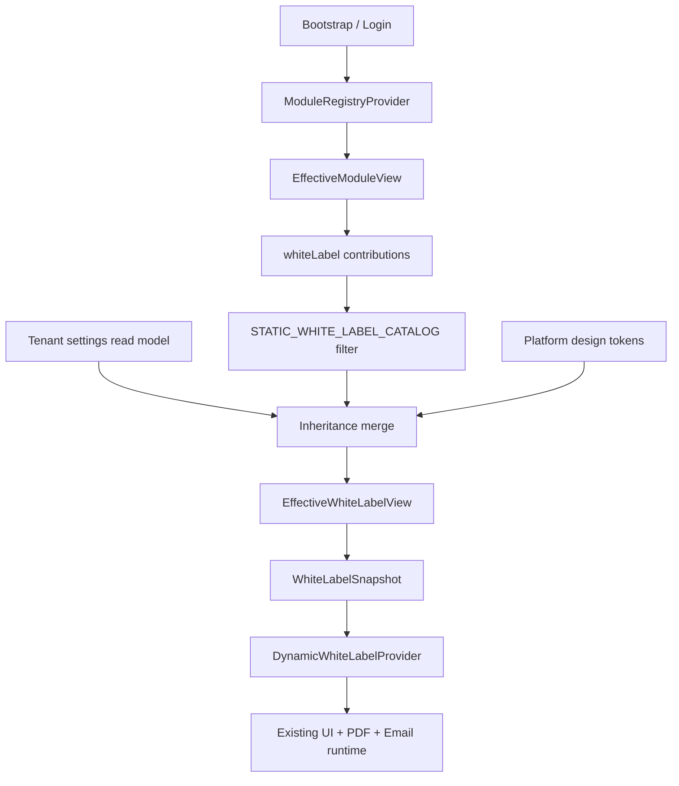
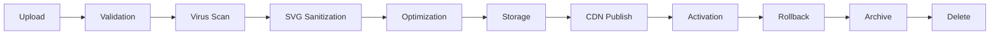
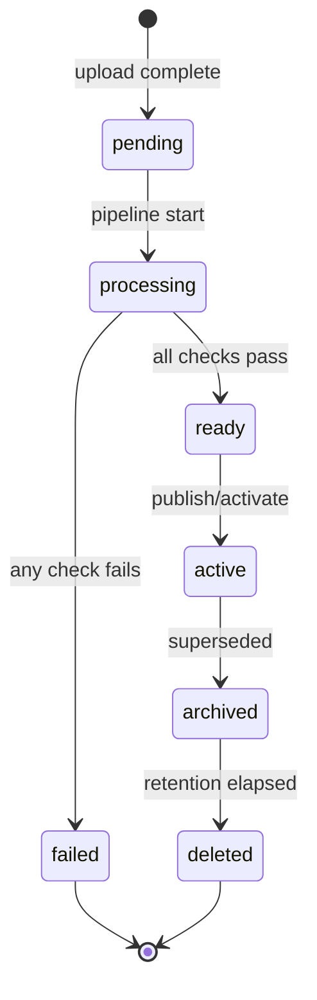

# Phase 35 — Dynamic White Label Architecture

**Phase:** 35 (**35a CLOSED** · **35b CLOSED** · **35c CLOSED** · **Remediation CLOSED 2026-07-14**)  
**Status:** **35b provider implemented** (2026-07-14) — registry-driven snapshot pipeline, CSS token application, rollback flag; configuration source migration only  
**Prerequisite:** Phase 34 — Dynamic Analytics (**permanently closed**, 2026-07-14)  
**Authoring panel:** CTO · Principal Enterprise SaaS · Healthcare ERP · Platform · Backend · Frontend · Security · DevOps  
**SSOT for:** Phase 35 implementation (35a, 35b, 35c), future Marketplace branding/theme extensions, Plugin SDK white-label packs, patient-portal and super-admin consumers

---

## 1. Executive Summary

Phase 35 migrates the **source of white-label configuration and discoverability metadata** from scattered tenant JSON (`Tenant.features.branding`), ad hoc CSS overrides, and hardcoded design tokens to a **registry-driven, layered Effective White Label View** — **without** changing licensing enforcement, RBAC, settings mutation APIs, media storage, email/PDF execution pipelines, or database schema in this architecture phase.

White Label becomes the **seventh registry consumer** (after navigation, routing, dashboard, search, reporting, and analytics), using the proven **catalog-as-baseline** pattern established in Phases 29–34:

```
Module Registry
  ↓
EffectiveModuleView (whiteLabel contributions)
  ↓
Effective Configuration (tenant / organization / branch overrides)
  ↓
STATIC_WHITE_LABEL_CATALOG filter (parity baseline)
  ↓
DynamicWhiteLabelProvider
  ↓
Existing Runtime (design tokens, AppShell, Login, emails, PDFs, exports, patient portal)
```

### Purpose

Provide an enterprise multi-tenant healthcare platform where licensed tenants can fully brand every customer-facing and staff-facing surface — logos, themes, layouts, localization, identity, and marketplace theme packs — while preserving all existing runtime behavior until implementation increments authorize changes.

### Scope

| In scope (architecture) | Out of scope (this phase) |
|-------------------------|---------------------------|
| Canonical white-label vocabulary in `@booking/module-registry` | React components, providers, hooks (35b) |
| `EffectiveWhiteLabelView` read model design | Prisma schema changes |
| `STATIC_WHITE_LABEL_CATALOG` parity baseline spec | Settings API redesign |
| `DynamicWhiteLabelProvider` responsibilities | CDN deployment or asset pipeline code |
| Inheritance: platform → tenant → organization → branch | Phase 36 Multi-Branch runtime |
| Rollback flag `VITE_USE_STATIC_WHITE_LABEL_ONLY` | Playwright acceptance (35c) |
| Security, performance, marketplace models | CSS/theme runtime rewrite |
| Migration roadmap 35a / 35b / 35c | LicensingEngineService changes |

### Business value

- **Enterprise differentiation:** Resellers and hospital groups present a fully owned brand across dashboard, portal, emails, and PDFs.
- **Licensing coherence:** Branding surfaces follow the same EffectiveModuleView pipeline as Phases 30–34; `customBranding` and `whiteLabel` features gate discoverability — not a parallel feature matrix.
- **Operational safety:** Independent rollback flag; fail-closed loading; static parity baseline from `@booking/design-tokens`.
- **Marketplace readiness:** Namespaced theme packs, signed asset bundles, and font/color extensions without schema redesign.

### Current state (evidence — source code audit 2026-07-14)

| Layer | State | Source |
|-------|-------|--------|
| Tenant branding storage | Partial JSON blob | `Tenant.features.branding` via `SettingsService` |
| Branding settings UI | Basic form | `BrandingSettingsPage.tsx` — logo, favicon, 2 colors, theme pref, 4 surface toggles |
| Licensed features | 2 features | `customBranding` (business+), `whiteLabel` (enterprise) — `licensing.config.ts` |
| Custom domain | Tenant column | `Tenant.customDomain` — gated by `whiteLabel` feature on PATCH |
| Design tokens (platform default) | CSS variables | `packages/design-tokens/css/tokens.css` |
| PDF/report branding | Server-side | `ReportBrandingService` — logo bytes + clinic name |
| Analytics PDF branding | Server-side | `analytics-report-pdf.ts` → `buildDashboardPdfBytes(..., branding)` |
| Registry `whiteLabel` contributions | **10** surfaces | `settings` module — `buildWhiteLabelContributionsForModule('settings')` (35a) |
| Dynamic white-label provider | **Implemented** (35b) | `DynamicWhiteLabelProvider` + `useWhiteLabel()` |
| Static white-label catalog | **Implemented** (parity baseline only) | `STATIC_WHITE_LABEL_CATALOG` — not consumed at runtime (35a) |
| AppShell theme application | Partial | `data-theme` on document; tenant colors **not wired globally** |
| Email branding | Metadata flag only | `emailBranding` toggle stored; template pipeline uses platform defaults |
| Patient portal branding | Metadata flag only | `patientPortalBranding` toggle stored; stub portal unchanged |
| i18n / RTL | Platform package | `@booking/i18n` — EN + AR-SY; locale in localStorage |
| Marketplace theme hooks | Schema only | `ModulePresentation.themeTokens` in manifest §23 — unused at runtime |

**Gap vs enterprise white label:** Branding is **settings-centric and fragmented**. No unified snapshot, no registry-driven surface catalog, no branch/org inheritance, no CDN asset strategy, no CSP model for custom domains, and no frontend provider consuming EffectiveModuleView.

---

## 2. Architecture Goals

| Goal | Success criterion |
|------|-------------------|
| Registry-driven white label | Surface catalog, feature gates, and settings discoverability derive from EffectiveModuleView |
| Zero enforcement change | `LicensingEngineService`, `@RequireLicensedFeature('customBranding' \| 'whiteLabel')`, settings PATCH guards unchanged |
| Zero runtime change (35 arch) | No production code in architecture phase |
| Catalog parity | Every builtin branding surface declared once in manifests + static catalog |
| Layered inheritance | Platform defaults → tenant → organization → branch with narrow-only overrides |
| Fail-closed defaults | Invalid catalog → startup error; registry error → static rollback; missing assets → platform fallback (never cross-tenant) |
| Independent rollback | `VITE_USE_STATIC_WHITE_LABEL_ONLY=true` restores pre-Phase-35 behavior instantly |
| Marketplace-ready | Theme packs, asset packs, fonts, color packs via `whiteLabel` extension contributions |
| Cross-consumer consistency | Dashboard, search, reporting, analytics, routing, notifications, emails, exports, PDFs, patient portal read **one** EffectiveWhiteLabelView projection |

---

## 3. Design Principles

1. **Server remains authoritative** — Licensing and RBAC applied at bootstrap and settings PATCH; client never re-evaluates `LicensingEngineService` or permission matrix for registry-mode surface discovery.
2. **Catalog-as-baseline** — `STATIC_WHITE_LABEL_CATALOG` is rollback truth and parity reference (same as Phases 30–34).
3. **Configuration migration only (35b)** — Move discoverability and resolved configuration projection to provider; existing components apply tokens — no visual redesign.
4. **No second systems** — White label must not become a parallel licensing engine, RBAC matrix, or settings store.
5. **Stable IDs** — `surfaceId`, `tokenGroupId`, `themePackId`, and `extensionId` are permanent; URLs and asset keys derive from them.
6. **Separation of metadata vs assets** — Registry publishes **what surfaces exist and which features gate them**; tenant settings and media storage publish **asset references and override values**; CDN serves bytes.
7. **Fail closed** — Integrity validation blocks duplicate surface IDs, invalid asset MIME types, and cross-tenant asset references at bootstrap/build time.
8. **Execution boundary** — PDF generation, email rendering, and push notification templates remain in existing backend modules; provider supplies **resolved branding DTO** only.

---

## 4. Registry Integration

### 4.1 Consumer boundary

```
ModuleRegistryProvider (existing)
  └── EffectiveModuleView[]
        └── extensions[] where kind === 'whiteLabel'
              └── payload: WhiteLabelContributionView (client projection)
```

**Reads:** `useModuleRegistry().modules` for surface discoverability and feature linkage.  
**Also reads (35b):** tenant branding settings from existing settings bootstrap or dedicated read API — **never mutates**.  
**Never reads:** raw manifests, `LicensingEngineService`, permission matrix JSON, or unscoped media URLs.

### 4.2 White label is not a LicensedModuleId

Per Phase 29 §9.13: White label extensions are owned by the **`settings` module** (and future marketplace packages). Licensing uses:

| Feature | Plan gate (today) | Gated surfaces |
|---------|-------------------|----------------|
| `customBranding` | business+ | Logo, colors, favicon, invoice/report/email/portal toggles |
| `whiteLabel` | enterprise | Custom domain, advanced theme packs, login page, email sender identity, watermarks |

Registry **discovers** admin settings routes (`/settings/branding`, future `/settings/custom-domain`); **enforcement** remains in `SettingsService` + `SubscriptionEnforcementService`.

### 4.3 Gating dimensions (from EffectiveModuleView)

| Dimension | Source | Client use |
|-----------|--------|------------|
| Module licensed | `module.userVisible` | Hide all settings white-label surfaces when settings module hidden |
| Module accessible | `module.userAccessible` | Exclude surfaces when license/dependency blocks settings |
| Extension visible | `extension.userVisible` | Per-surface admin nav visibility |
| Extension accessible | `extension.userAccessible` | Per-surface RBAC already applied server-side |
| Feature licensing | `extension.featureId` / `requiredFeature` | Surface requires `customBranding` or `whiteLabel` |
| Dependency health | `module.lockReason` | Fail-closed hide when settings module blocked |

### 4.4 Integration with frozen phases

| Phase | Relationship |
|-------|--------------|
| 28 Licensing | Unchanged — features feed bootstrap and settings PATCH only |
| 29 Registry | White label consumes EffectiveModuleView; extends `WhiteLabelContribution` schema (35a) |
| 30 Routing | Branding settings routes remain in route catalog; login/guest routes static |
| 31 Dashboard | Widget chrome reads resolved theme tokens from white-label snapshot — not widget catalog |
| 32 Search | Search dialog chrome (icons, accent) reads snapshot — entity catalog unchanged |
| 33 Reporting | PDF/export **execution** uses server branding resolver; catalog may expose `brandingSurface: 'pdf'` hint |
| 34 Analytics | Chart `visualizationThemeKey` maps to snapshot chart tokens — query execution unchanged |

### 4.5 Provider mount point

`DynamicWhiteLabelProvider` mounts at **`main.tsx` / App root scope** (above `AppShell`, alongside `I18nProvider`) so login, guest, and shell routes share one snapshot. Settings admin pages **consume** the same provider for preview — they do not own a separate theme context.

---

## 5. White Label Contribution Model

### 5.1 Current schema (`WhiteLabelContribution`)

Today in `packages/module-registry/src/types.ts`:

```typescript
interface WhiteLabelContribution extends ExtensionBase {
  surface: 'branding' | 'customDomain' | 'theme' | 'loginPage';
  requiredFeature: string;
  settingsPath?: string;
}
```

### 5.2 Extended schema (Phase 35 design — additive)

```typescript
type WhiteLabelSurfaceKind =
  | 'branding'           // general brand admin
  | 'customDomain'       // DNS / domain verification admin
  | 'theme'              // color/typography token admin
  | 'loginPage'          // login layout + hero
  | 'layout'             // nav/sidebar/topbar density
  | 'localization'       // locale/regional formats admin
  | 'identity'           // org/clinic/branch naming + support contacts
  | 'emailTemplate'      // transactional email brand slots
  | 'pdfTemplate'        // report/invoice PDF brand slots
  | 'patientPortal'      // portal-specific brand pack
  | 'marketplacePack';   // installed theme/asset pack (future)

interface WhiteLabelContribution extends ExtensionBase {
  // ── Identity ──
  surfaceId: string;                     // stable catalog key (matches STATIC_WHITE_LABEL_CATALOG)
  localId: string;                       // manifest-local segment
  surface: WhiteLabelSurfaceKind;

  // ── Licensing (reference — server already applied userAccessible) ──
  requiredFeature: LicensedFeatureId;    // customBranding | whiteLabel
  optionalFeatures?: LicensedFeatureId[];

  // ── Admin navigation ──
  settingsPath?: string;                 // e.g. '/settings/branding'
  adminResourceId?: string;              // default 'api.settings'
  adminAction?: 'view' | 'update';

  // ── Runtime surfaces (metadata — which app areas consume this pack) ──
  appliesTo: WhiteLabelApplyTarget[];

  // ── Asset / token declarations (references only — not bytes) ──
  tokenGroups?: ThemeTokenGroupId[];     // color | typography | spacing | ...
  assetSlots?: BrandAssetSlotId[];       // logo-light | favicon | splash | ...
  layoutProfileId?: LayoutProfileId;
  localizationPackId?: LocalizationPackId;

  // ── Marketplace (future) ──
  themePackId?: string;                  // namespaced: acme.healthcare-pro
  providerKey?: string;
  integrityRequired?: boolean;

  // ── Presentation ──
  labelKey: string;
  descriptionKey?: string;
  sortOrder: number;
}

type WhiteLabelApplyTarget =
  | 'appShell' | 'login' | 'email' | 'pdf' | 'export' | 'patientPortal'
  | 'dashboard' | 'search' | 'reporting' | 'analytics' | 'routing'
  | 'notifications' | 'splash' | 'loading';
```

`extensionId` pattern: `{moduleId}/whiteLabel/{localId}` via `moduleWhiteLabel*()` builders.

### 5.3 Builtin contribution inventory (proposed baseline)

| surfaceId | surface | requiredFeature | settingsPath | appliesTo |
|-----------|---------|-----------------|--------------|-----------|
| `settings-branding-core` | branding | customBranding | `/settings/branding` | appShell, pdf, email, export |
| `settings-branding-login` | loginPage | whiteLabel | `/settings/branding#login` | login, splash |
| `settings-custom-domain` | customDomain | whiteLabel | `/settings/integrations#domain` | routing, login, email |
| `settings-theme-advanced` | theme | customBranding | `/settings/branding#theme` | appShell, dashboard, analytics |
| `settings-layout-profile` | layout | customBranding | `/settings/branding#layout` | appShell, dashboard |
| `settings-localization` | localization | customBranding | `/settings/localization` | appShell, pdf, export |
| `settings-identity` | identity | customBranding | `/settings/clinic-profile` | email, pdf, login, patientPortal |
| `settings-email-brand` | emailTemplate | customBranding | `/settings/branding#email` | email, notifications |
| `settings-pdf-brand` | pdfTemplate | customBranding | `/settings/branding#pdf` | pdf, export, reporting, analytics |
| `settings-portal-brand` | patientPortal | customBranding | `/settings/branding#portal` | patientPortal |

**Count:** **10** builtin catalog entries (settings module) + **N** marketplace packs at runtime.

---

## 6. Static White Label Catalog

### 6.1 Purpose

`STATIC_WHITE_LABEL_CATALOG` is the **parity baseline and rollback authority** for all white-label surfaces, token groups, asset slots, and layout profiles — analogous to `STATIC_REPORT_CATALOG` and `STATIC_ANALYTICS_CATALOG`.

| Property | Value |
|----------|-------|
| Runtime authority | **`false`** until 35b — joined by provider, not direct UI import in registry mode |
| Location (35a) | `apps/clinic-dashboard/src/features/dynamic-white-label/lib/static-white-label-catalog.ts` |
| Canonical SSOT (35a) | `packages/module-registry/src/white-label/*` |
| Integrity | `validateBuiltinWhiteLabelIntegrity()` at bootstrap |

### 6.2 Catalog entry shape

```typescript
interface StaticWhiteLabelCatalogEntry {
  surfaceId: string;
  moduleId: string;                      // owner module (usually 'settings')
  surface: WhiteLabelSurfaceKind;
  requiredFeature: LicensedFeatureId;
  settingsPath?: string;
  appliesTo: WhiteLabelApplyTarget[];
  tokenGroups: ThemeTokenGroupId[];
  assetSlots: BrandAssetSlotId[];
  layoutProfileId?: LayoutProfileId;
  defaultEnabled: boolean;               // when feature licensed, is surface on by default?
  rollbackBehavior: 'platform' | 'tenant-json';  // static rollback source
}
```

### 6.3 Relationship to design tokens

Platform defaults originate from `packages/design-tokens/css/tokens.css` and `docs/design-tokens.json`. The static catalog **references** token group IDs; it does not duplicate hex values. Tenant overrides map onto the same token keys.

---

## 7. EffectiveWhiteLabelView Design

### 7.1 Definition

`EffectiveWhiteLabelView` is the **resolved, read-only white-label configuration** for a specific **identity context** (tenant + user + branch + locale). It is not stored as source of truth — it is computed from registry contributions, tenant settings, and inheritance rules.

```typescript
interface EffectiveWhiteLabelView {
  // ── Identity context ──
  tenantId: string;
  branchId: string | null;
  locale: string;
  direction: 'ltr' | 'rtl';

  // ── Access / licensing projection ──
  brandingEnabled: boolean;              // customBranding effective
  whiteLabelEnabled: boolean;            // whiteLabel effective
  accessibleSurfaces: WhiteLabelSurfaceSnapshot[];
  lockedSurfaces: LockedWhiteLabelSurface[];

  // ── Resolved brand payload ──
  identity: BrandIdentitySnapshot;
  assets: BrandAssetsSnapshot;
  theme: ThemeSnapshot;
  layout: LayoutSnapshot;
  localization: LocalizationSnapshot;
  surfaces: SurfaceEnablementSnapshot;   // invoice/report/email/portal toggles

  // ── Marketplace overlays (future) ──
  installedThemePacks: ThemePackSnapshot[];

  // ── Metadata ──
  source: WhiteLabelResolutionSource;
  catalogGeneration: number | null;
  settingsVersion: string | null;        // hash of active (published) branding JSON
  assetGeneration: number | null;        // monotonic; bumps on asset activation (§31)
  previewMode: boolean;                  // true only in authorized admin preview context (§34)
  resolvedAt: string;
}

type WhiteLabelResolutionSource =
  | 'registry'           // registry + tenant settings merge
  | 'static'             // rollback flag
  | 'static-fallback'    // registry error
  | 'restricted';        // fail-closed minimal platform brand
```

### 7.2 Inheritance chain (narrow-only)

Resolution order — **later layers may override earlier layers only where explicitly allowed; never widen licensing**:

```
1. Platform defaults          (@booking/design-tokens + STATIC_WHITE_LABEL_CATALOG defaults)
2. Registry contributions     (which surfaces/token groups exist — filtered by EffectiveModuleView)
3. Tenant settings            (Tenant.features.branding + Tenant.name + Tenant.customDomain)
4. Organization profile       (Tenant.features.clinicProfile — name, logo, support email)
5. Branch overrides           (Branch.features.branding? — Phase 36 storage; architecture reserved)
6. User preference overlay    (theme light/dark/system — non-persistent brand, UI-only)
7. Marketplace theme pack     (if installed + licensed — merges token groups and asset slots)
```

| Layer | May override | Must not |
|-------|--------------|----------|
| Platform | — | Enable enterprise features |
| Registry | Surface discoverability | Store tenant asset bytes |
| Tenant | Colors, logos, toggles, domain | Exceed plan features |
| Organization | Display names, support contacts | Bypass RBAC |
| Branch | Branch logo, branch accent (optional) | Cross-branch asset references |
| User pref | Color scheme mode only | Tenant primary palette |
| Marketplace pack | Token groups declared in pack manifest | Unsigned/unverified packs |

**Fail-closed:** If a layer fails validation (invalid color, unknown asset key, cross-tenant media ID), that layer is **skipped** and the previous layer value retained — never platform-widen to another tenant's assets.

### 7.3 Organization vs tenant vs branch

| Field | Tenant | Organization profile | Branch (Phase 36) |
|-------|--------|----------------------|-------------------|
| Legal/org name | `Tenant.name` | `features.clinicProfile.displayName` | `Branch.name` |
| Logo | `branding.logoStorageKey` | `clinicProfile.logoStorageKey` | `branch.branding.logoStorageKey?` |
| Primary color | `branding.primaryColor` | inherit tenant | `branch.branding.primaryColor?` |
| Support email | `features.notificationSettings` | `clinicProfile.supportEmail` | branch contact |
| Custom domain | `Tenant.customDomain` | — | subdomain optional (future) |
| Email sender name | `branding.emailSenderName?` | clinic display name | branch name |

### 7.4 Resolution pipeline

```
EffectiveModuleView[]
  → filter modules where userVisible
  → flatten extensions where kind === 'whiteLabel'
  → filter extension.userVisible && extension.userAccessible
  → inner-join STATIC_WHITE_LABEL_CATALOG by surfaceId
  → load tenant settings snapshot (existing settings API / bootstrap payload)
  → apply inheritance chain §7.2
  → validate assets + tokens (fail-closed per field)
  → build EffectiveWhiteLabelView
  → project to WhiteLabelSnapshot (provider DTO)
```

### 7.5 Server-side mirror (35b backend increment — design only)

Frontend provider is UX-authoritative for **application chrome**. Backend PDF/email/notifications use a **server-side `WhiteLabelResolver`** with identical inheritance rules reading the same tenant JSON — prevents FE/BE brand drift. Architecture specifies contract; implementation deferred to 35b with **no API shape change** in 35a.

---

## 8. DynamicWhiteLabelProvider

### 8.1 Placement

```
main.tsx
  └── QueryClientProvider
        └── AuthProvider
              └── ModuleRegistryProvider (when authenticated)
                    └── DynamicWhiteLabelProvider (new — Phase 35b)
                          └── I18nProvider (consumes localization slice from snapshot)
                                └── RouterProvider
                                      ├── Guest routes (login — consume snapshot)
                                      └── AppShell (sidebar, topbar — consume snapshot)
```

### 8.2 Public API (responsibilities only — not implemented)

```typescript
interface DynamicWhiteLabelContextValue {
  view: EffectiveWhiteLabelView;
  snapshot: WhiteLabelSnapshot;          // immutable projection for consumers
  theme: ThemeSnapshot;
  assets: BrandAssetsSnapshot;
  layout: LayoutSnapshot;
  localization: LocalizationSnapshot;
  capabilities: WhiteLabelCapabilities;
  source: WhiteLabelResolutionSource;
  isRegistrySource: boolean;
  isLoading: boolean;
  error: Error | null;
  registryStatus: 'idle' | 'loading' | 'ready' | 'error' | 'disabled';
  settingsVersion: string | null;
  refresh: () => Promise<void>;
}

function useWhiteLabel(): DynamicWhiteLabelContextValue;
function useOptionalWhiteLabel(): DynamicWhiteLabelContextValue | null;
```

### 8.3 Responsibilities

| Responsibility | Owner |
|----------------|-------|
| Read EffectiveModuleView whiteLabel extensions | ✅ provider |
| Join STATIC_WHITE_LABEL_CATALOG | ✅ provider |
| Fetch/cache tenant branding settings read model | ✅ provider |
| Apply inheritance chain → EffectiveWhiteLabelView | ✅ provider |
| Expose theme/assets/layout/localization snapshots | ✅ provider |
| Derive `WhiteLabelCapabilities` from licensed surfaces | ✅ provider |
| Apply CSS custom properties to document (`data-theme`, token vars) | ✅ provider (35b) |
| Identity-scoped cache | ✅ provider |
| `refresh()` on settings save / registry bump | ✅ provider |
| Mutate tenant settings | ❌ — settings pages + API |
| Evaluate LicensingEngineService | ❌ |
| Evaluate RBAC matrix | ❌ |
| Serve media bytes | ❌ — media CDN/API |
| Generate PDFs or emails | ❌ — backend services |

### 8.4 Algorithm (mirrors DynamicAnalyticsProvider)

1. `assertWhiteLabelCatalogLoaded()` at module load.
2. If `!isRegistryWhiteLabelEnabled()` → `buildStaticWhiteLabelSnapshot()` from tenant JSON + design tokens.
3. If registry error → `static-fallback` snapshot (never widen surfaces beyond tenant license).
4. If registry loading + empty modules → fail-closed cascade (§17).
5. If registry loaded → merge registry surfaces + tenant settings → `buildRegistryWhiteLabelSnapshot()`.
6. Cache by identity key (§16).
7. Clear cache on identity/settings change.
8. Apply `ThemeSnapshot` to `document.documentElement` CSS variables.

### 8.5 Consumption points (35b — configuration source only)

| Consumer | Today | Phase 35b reads |
|----------|-------|-----------------|
| `AppShell` / Sidebar / TopNav | design tokens only | `useWhiteLabel().layout`, `.theme`, `.assets` |
| `LoginPage` | platform brand | `useWhiteLabel().assets`, `.identity` |
| `BrandingSettingsPage` | direct settings API | preview via **DraftWhiteLabelSnapshot** (§34); production via **EffectiveWhiteLabelSnapshot** |
| `FeatureGate` (branding) | subscription hook | unchanged — gating stays subscription SSOT |
| Chart renderers (analytics/reporting) | Recharts defaults | `theme.chart` tokens |
| `GlobalSearchDialog` | design tokens | `theme.semantic`, accent |
| Export/download UI | platform | `assets.watermark` metadata |
| Patient portal stub | platform | `surfaces.patientPortal` + identity |
| Email/PDF (backend) | `ReportBrandingService` | server resolver — same DTO contract |

---

## 9. Configuration Resolution Flow



### 9.1 Settings read model (no mutation in provider)

Provider consumes a **read-only branding DTO** aligned with today's `SettingsService.getOverview()` branding section:

```typescript
interface TenantBrandingSettingsReadModel {
  logoStorageKey?: string;
  logoDarkStorageKey?: string;
  faviconStorageKey?: string;
  splashStorageKey?: string;
  primaryColor?: string;
  accentColor?: string;
  themePreference?: 'light' | 'dark' | 'system';
  invoiceBranding?: boolean;
  reportBranding?: boolean;
  emailBranding?: boolean;
  patientPortalBranding?: boolean;
  emailSenderName?: string;
  supportEmail?: string;
  watermarkEnabled?: boolean;
  customCssAllowed?: boolean;            // enterprise only — future
}
```

Fetched via existing settings query hook — **no new endpoint required for 35b MVP**; optional `GET /tenant/white-label/snapshot` may be added later for patient-portal and email workers.

---

## 10. Branding Model

### 10.1 Asset slots

| Slot ID | Purpose | Formats | Max size (design) |
|---------|---------|---------|-------------------|
| `logo-light` | App shell, PDF (light bg) | SVG, PNG, WebP | 512 KB |
| `logo-dark` | App shell dark mode | SVG, PNG, WebP | 512 KB |
| `favicon` | Browser tab | ICO, PNG | 64 KB |
| `splash` | Mobile/PWA splash | PNG | 1 MB |
| `loading-mark` | Loading spinner center | SVG, PNG | 128 KB |
| `login-hero` | Login background/hero | JPG, PNG, WebP | 2 MB |
| `email-header` | Email template header | PNG | 256 KB |
| `pdf-watermark` | Diagonal PDF watermark | PNG (alpha) | 256 KB |
| `portal-logo` | Patient portal | SVG, PNG | 512 KB |

Assets stored as **`MediaAsset.storageKey`** references — never inline bytes in registry or snapshot JSON.

Each slot binding carries a deterministic **`BrandAssetVersionRef`** (see §31). Today’s `logoStorageKey`-only model maps to `{ slotId: 'logo-light', storageKey, assetVersion: 1, contentHash }` in 35a vocabulary — no runtime migration in this remediation.

### 10.2 URL resolution

```
storageKey + contentHash + assetVersion
  → immutable CDN path (§31.4)
  → optional signed URL wrapper (short TTL) for private-origin fetch
```

Provider snapshot exposes:

| Field | Purpose |
|-------|---------|
| `storageKeys` | Stable tenant media references (settings JSON) |
| `assetVersions` | Monotonic version per slot |
| `contentHashes` | SHA-256 of normalized bytes — cache-bust authority |
| `resolvedUrls` | Ephemeral signed URLs derived from immutable CDN paths |

**Rule:** Cache-busting uses **`contentHash` in the CDN path**, not query-string randomness. Browsers and CDNs treat paths as immutable.

### 10.3 Surface enablement

| Surface toggle | Affects |
|----------------|---------|
| `invoiceBranding` | Billing PDFs, invoice emails |
| `reportBranding` | Operational reports, reporting export center |
| `emailBranding` | Transactional + notification email templates |
| `patientPortalBranding` | Portal header, login, emails to patients |

When toggle `false`, runtime uses **platform default** for that surface — not unbranded PHI content.

### 10.4 Watermarks

Enterprise `whiteLabel` feature enables optional PDF/export watermark (`assets.watermark`). Watermark text defaults to `{clinicDisplayName} — Confidential`; override via tenant settings. Applied in existing PDF builders only — not UI overlay.

---

## 11. Theme Model

### 11.1 Token groups

| Group ID | CSS variables (examples) | Override source |
|----------|---------------------------|-----------------|
| `color-primary` | `--color-primary-*`, `--color-primary` | tenant `primaryColor` → generated scale |
| `color-accent` | `--color-secondary-*`, accent aliases | tenant `accentColor` |
| `color-semantic` | `--color-success`, `--color-warning`, `--color-error`, `--color-info` | tenant optional overrides |
| `color-surface` | `--color-bg`, `--color-surface`, `--color-border`, text colors | theme mode + tenant |
| `typography` | `--font-latin`, `--font-arabic`, `--text-*` | marketplace font packs |
| `spacing` | `--space-*` | layout profile |
| `radius` | `--radius-*` | theme pack |
| `shadow` | `--shadow-*` | theme pack |
| `chart` | `--chart-series-*`, `--chart-grid`, `--chart-tooltip` | analytics/reporting charts |
| `status` | queue/clinical status colors | semantic group |

### 11.2 Theme generation

Tenant `primaryColor` / `accentColor` (hex) → **algorithmic scale generation** (50–900) at resolve time — same approach as design-token scales. Invalid hex → fail-closed to platform primary.

### 11.3 Dark / light / system

`themePreference` from tenant settings maps to `document.documentElement[data-theme]`. Provider syncs with `@booking/design-tokens` dark block. User OS preference respected when `system`.

### 11.4 Icons

Icon **style** (outline vs solid) and **density** are layout profile attributes — not per-icon overrides. Lucide remains canonical icon set; marketplace packs may register **additional SVG sprites** via signed asset bundles (future).

### 11.5 Theme token governance (summary)

Full classification, precedence, and validation rules: **§32**. Marketplace packs may override only **Tenant Override** and designated **Marketplace Theme** tokens — never **Platform Locked** tokens.

---

## 12. Layout Model

### 12.1 Layout profiles

| Profile ID | Navigation | Sidebar | Top bar | Menu density |
|------------|------------|---------|---------|--------------|
| `clinical-default` | sidebar | 260px expanded | standard | comfortable |
| `clinical-compact` | sidebar | 72px collapsed default | compact | compact |
| `enterprise-topnav` | top primary | hidden / drawer | prominent | comfortable |
| `minimal-login` | none | none | none | — |

### 12.2 Dashboard defaults

Layout profile may specify **default dashboard profile hint** (owner vs clinical) — metadata only; `DynamicDashboardProvider` remains authoritative for widgets.

### 12.3 Landing and login

Login page layout variants: `split-hero`, `centered-card`, `full-bleed-image` — selected by `loginPage` surface contribution + tenant setting. Guest routes consume snapshot **without** full registry bootstrap where possible (static fallback + tenant slug resolution for custom domain).

### 12.4 Footer

Optional footer slot: support link, privacy policy URL, powered-by toggle (hidden when `whiteLabel` enabled).

---

## 13. Localization Model

### 13.1 Layers

| Layer | Source | Keys |
|-------|--------|------|
| Platform i18n | `@booking/i18n` | EN, AR-SY |
| Tenant localization settings | `features.localizationSettings` | enabled locales, default locale |
| White-label snapshot | `LocalizationSnapshot` | resolved locale, direction, formats |

### 13.2 RTL / LTR

Direction derived from locale (`ar-SY` → RTL). Provider sets `document.documentElement.dir` — may override `I18nProvider` if snapshot locale differs from user preference (architecture: **user locale wins**; direction follows user locale).

### 13.3 Regional formats

| Setting | Resolution |
|---------|------------|
| Date format | tenant `localizationSettings.dateFormat` → ICU pattern |
| Time format | 12h/24h from tenant settings |
| Currency | `clinicProfile.defaultCurrency` or branch override |
| Number format | locale-driven separators |
| Timezone | `Tenant.timezone` (existing) |

### 13.4 Marketplace locale packs

Plugins register **`localizationPackId`** in whiteLabel contributions — adds message namespace + optional RTL locale. Requires platform approval before tenant install.

---

## 14. Domain & Identity Model

### 14.1 Custom domains

| Concern | Design |
|---------|--------|
| Storage | `Tenant.customDomain` (existing) |
| Feature gate | `whiteLabel` + `customDomain` surface contribution |
| Verification | DNS TXT/CNAME challenge (future 35b backend) — architecture reserves `domainVerificationStatus` in snapshot |
| Routing | Host header → tenant resolution middleware (future) — **out of 35a scope** |
| TLS | Platform-managed certificates (wildcard + per-tenant SAN) — DevOps |

### 14.2 Naming hierarchy

```
Platform brand (Booking System)
  └── Tenant organization name (Tenant.name)
        └── Clinic display name (clinicProfile.displayName)
              └── Branch name (Branch.name — Phase 36)
```

Email **From** display name: `branding.emailSenderName` ?? clinic display name ?? tenant name.

### 14.3 Support contacts

`snapshot.identity.supportEmail`, `supportPhone`, `supportUrl` — used in email footers, login help link, PDF footer.

---

## 15. Feature Branding Consistency

| Feature area | Branding application | Provider slice |
|--------------|---------------------|----------------|
| **Dashboard** | Shell chrome, KPI chart colors | `theme.chart`, `layout` |
| **Search** | Dialog accent, icons | `theme.semantic` |
| **Reporting** | Export center chrome; PDF via backend | `surfaces.report`, server PDF resolver |
| **Analytics** | Domain page charts, builder widgets | `theme.chart` |
| **Routing** | Login/guest pages; custom domain host | `identity`, `assets` |
| **Notifications** | In-app toast colors; email template header | `theme.semantic`, `assets.email-header` |
| **Emails** | Header logo, colors, footer identity | server resolver + `surfaces.email` |
| **Exports** | CSV header comment; PDF/Excel branded header | `surfaces.report`, PDF resolver |
| **PDFs** | Logo, clinic name, watermark | `ReportBrandingService` contract alignment |
| **Patient portal** | Logo, colors, portal name | `surfaces.patientPortal`, `assets.portal-logo` |

**Rule:** No feature module hardcodes tenant hex values in registry mode. Static rollback mode may read tenant JSON directly (parity with today).

---

## 16. Marketplace Model

### 16.1 Plugin registration

Marketplace packages contribute via manifest:

```typescript
// extensions.whiteLabel[] — example marketplace entry
{
  extensionId: 'acme.themes/whiteLabel/pro-pack',
  surfaceId: 'acme.themes.pro-pack',
  surface: 'marketplacePack',
  requiredFeature: 'whiteLabel',
  themePackId: 'acme.themes.pro-pack',
  providerKey: 'marketplace.acme',
  tokenGroups: ['color-primary', 'typography', 'radius', 'shadow'],
  assetSlots: ['logo-light', 'login-hero'],
  appliesTo: ['appShell', 'login', 'dashboard'],
  integrityRequired: true
}
```

### 16.2 Pack types

| Pack type | Contains | Install gate |
|-----------|----------|--------------|
| **Theme pack** | Token overrides + layout profile | `whiteLabel` + marketplace signature |
| **Asset pack** | Logo/splash/favicon sets | `customBranding` + storage quota |
| **Font pack** | `@font-face` declarations (CDN) | `whiteLabel` + CSP allowlist |
| **Color pack** | Primary/accent/semantic presets | `customBranding` |
| **Brand extension** | Email/PDF template partials | `whiteLabel` + template sandbox |

### 16.3 Merge rules

Installed packs merge **after** tenant settings in inheritance chain — **tenant explicit overrides always win** over pack defaults for the same token key. Unsigned or unverified packs → **fail-closed reject** (not loaded).

### 16.4 No architecture redesign

Marketplace hooks use existing `ModuleIntegrity`, `publisher`, and extension point index from Phase 29 §23 — no new extension kind required.

---

## 17. Cache and Refresh Strategy

### 17.1 Cache key dimensions

```typescript
interface WhiteLabelCacheIdentity {
  tenantId: string;
  userId: string | null;                 // null on guest/login pre-auth pages
  rolesHash: string | null;
  branchId: string | null;
  locale: string;
  catalogGeneration: number | null;
  entitlementVersion: string | null;
  settingsVersion: string | null;        // hash of active branding JSON
  assetGeneration: number | null;
  previewMode: boolean;
  themePackGeneration: number;           // marketplace installs
  source: WhiteLabelResolutionSource;
}
```

### 17.2 Invalidation triggers

| Event | Action |
|-------|--------|
| Login / logout | clear all white-label cache |
| Tenant switch | clear + rebuild |
| Branch switch | clear if branch overrides present |
| Locale change | rebuild snapshot (formats/direction) |
| Branding settings save (publish) | `settingsVersion` + `assetGeneration` bump → clear + refresh |
| Branding draft save (preview only) | draft cache only — **does not** invalidate production EffectiveWhiteLabelSnapshot (§34) |
| Asset activation | `assetGeneration` bump; CDN path switches to new `contentHash` (§31) |
| Registry refresh | rebuild if `catalogGeneration` changes |
| Theme pack install/remove | `themePackGeneration` bump |
| Custom domain verified | identity slice refresh |
| Entitlement change | clear on `entitlementVersion` change |

Integrated into `clearModuleRegistryCaches()` — add `clearWhiteLabelCache()` (mirrors analytics/reporting).

### 17.3 TTL and stale behavior

- In-memory provider cache TTL: **5 minutes** (soft) — matches Phases 33–34.
- Signed asset URLs TTL: **15 minutes** — refreshed on snapshot rebuild.
- CDN immutable assets: **1 year** cache-control; filename includes content hash.
- Stale snapshot served during in-flight `refresh()` if identity unchanged.

### 17.4 Preload strategy

After login bootstrap: preload `logo-light`, `logo-dark`, `favicon` via `<link rel="preload">`. Splash screen lazy-loaded. Login page may inline critical CSS variables only — not full logo bytes.

---

## 18. Rollback Strategy

### 18.1 Flag

```
VITE_USE_STATIC_WHITE_LABEL_ONLY=true
```

### 18.2 Behavior

| Condition | Behavior |
|-----------|----------|
| Flag enabled | `source: 'static'` — read tenant JSON + design tokens directly; ignore registry contributions |
| Registry API error | `source: 'static-fallback'` — same as static + log warning |
| Invalid catalog at startup | throw — app fails fast (fail-closed) |
| Partial registry load | `restricted` snapshot — platform brand only |

### 18.3 Playwright (35c)

Dedicated rollback server port **5178** (proposed) — mirrors ports 5174–5177 pattern from Phases 30–34.

### 18.4 Independence

Rollback is **independent** of nav/routing/dashboard/search/reporting/analytics flags — combinable for granular diagnosis.

---

## 19. Security Model

### 19.1 Asset validation

| Check | Enforcement |
|-------|-------------|
| MIME allowlist | image/svg+xml, image/png, image/webp, image/jpeg, image/x-icon |
| Max file size | per slot §10.1 |
| SVG sanitization | strip scripts/foreignObject on upload (media pipeline — 35b) |
| Storage key tenant scope | media asset `tenantId` must match resolution context |
| Hotlink prevention | signed URLs only; no public unauthenticated logo URLs for PHI apps |

### 19.2 Trusted uploads

Only **`api.settings` update** roles may change branding keys. Upload flow uses existing media module with virus scan hook (architecture requirement — verify at 35b).

### 19.3 CSP considerations

| Surface | CSP note |
|---------|----------|
| App shell | `style-src 'self' 'unsafe-inline'` (CSS vars) — tenant custom CSS enterprise-only behind flag + sanitizer |
| Custom domain | stricter CSP; no arbitrary `script-src` from tenant |
| Email | inline styles only in templates — no tenant JS |
| Marketplace fonts | `font-src` allowlist CDN hostnames per verified publisher |

### 19.4 Tenant isolation

- Cache keys **always** include `tenantId`.
- Provider never resolves storage keys from another tenant — fail-closed to platform default.
- Bootstrap white-label surfaces filtered server-side by tenant license.

### 19.5 Branding isolation

- Branch overrides (Phase 36) may only reference media assets with matching `tenantId` + branch scope.
- Marketplace packs tenant-scoped after install — no global shared mutable brand state.

### 19.6 Custom domain security

- Domain verification before serving tenant brand on host.
- Reject host header spoofing without verification record.
- Session cookies scoped to verified domain — architecture aligns with auth cookie policy (future).

---

## 20. Performance Strategy

### 20.1 Asset caching

| Tier | Strategy |
|------|----------|
| Browser | preload logos; lazy splash |
| CDN | immutable content-hash paths for media |
| API | short TTL signed URL cache (Redis) |
| Provider | in-memory snapshot cache (5 min soft TTL) |

### 20.2 CDN strategy

```
/media/c/{tenantId}/{assetHash}/{slotId}.webp
```

- WebP/AVIF derivatives generated on upload (architecture — implementation 35b+).
- SVG served as-is after sanitization.

### 20.3 Lazy loading

Non-critical asset slots (`splash`, `login-hero`, `email-header`) loaded on first surface navigation — not at bootstrap.

### 20.4 Bootstrap budget

White-label snapshot target **< 8 KB JSON** (excluding signed URLs). Heavy asset metadata paginated in settings admin only.

### 20.5 Cache invalidation

`settingsVersion` + `catalogGeneration` + content hash bump → new CDN path; old paths expire naturally (immutable).

---

## 21. Loading and Fail-Closed Behavior

Follow Phase 32b / 33b / 34b proven cascade:

```
1. Registry loading?
   → yes: use last known valid WhiteLabelSnapshot for same identity
2. Same-identity white-label cache hit?
   → use cached snapshot
3. Same-identity registry cache hit?
   → rebuild from cached EffectiveModuleView + cached settings
4. Else:
   → buildRestrictedWhiteLabelSnapshot() — platform tokens only, no tenant assets
```

**Never** fall back to a broader feature surface during loading (e.g. do not enable `whiteLabel` surfaces while entitlements unknown).

---

## 22. Validation and Integrity

### 22.1 Bootstrap validation (35a)

`validateBuiltinWhiteLabelIntegrity()`:

- Every catalog `surfaceId` has exactly one builtin manifest contribution.
- No duplicate `surfaceId`, `extensionId`, or `localId`.
- All `requiredFeature` values exist in `LICENSED_FEATURE_KEY`.
- All `settingsPath` values exist in `STATIC_ROUTE_CATALOG`.
- All `tokenGroups` / `assetSlots` reference canonical enums.
- Marketplace entries require `integrityRequired: true`.

### 22.2 Runtime validation (35b)

- Hex color regex + contrast ratio warning (WCAG AA) — non-blocking in admin UI.
- Unknown `storageKey` → omit asset, log metric.
- Circular theme pack dependencies → reject install.

---

## 23. Event Architecture (Design Only)

| Event | Publisher | Consumers | Purpose |
|-------|-----------|-----------|---------|
| `whitelabel.snapshot.created` | provider | telemetry | Snapshot metrics |
| `whitelabel.snapshot.invalidated` | cache | provider | Cache bust |
| `whitelabel.settings.changed` | settings API | provider, CDN | settingsVersion bump |
| `whitelabel.asset.uploaded` | media | pipeline | Queued for validation (§33) |
| `whitelabel.asset.activated` | media pipeline | provider, CDN | `assetGeneration` bump |
| `whitelabel.asset.archived` | media pipeline | CDN | prior version retired |
| `whitelabel.preview.opened` | settings admin | audit | preview session start |
| `whitelabel.preview.published` | settings admin | provider, CDN, audit | draft → active swap |
| `whitelabel.preview.discarded` | settings admin | draft cache | no production effect |
| `whitelabel.domain.verified` | settings | provider, routing | Custom domain activation |
| `whitelabel.themepack.installed` | marketplace | provider | themePackGeneration bump |

Events do **not** bypass licensing or RBAC.

---

## 24. Phase 36+ Integration Preview

| Phase | Integration |
|-------|-------------|
| **36 Multi-Branch** | Branch-level branding overrides in inheritance chain §7.2 |
| **37 Activity Center** | Brand-agnostic — no white-label dependency |
| **38 Audit Center** | Export PDFs use server white-label resolver |
| **44 Patient Portal app** | Consumes same snapshot contract via API |
| **45 Super Admin** | Platform brand separate tenant; no tenant white-label |

---

## 25. Implementation Roadmap

### Phase 35a — Foundation (Canonical Vocabulary & Catalog)

**Goal:** Single white-label SSOT; manifests declare all builtin surfaces; static catalog parity tests.

| Deliverable | Location |
|-------------|----------|
| `canonical-white-label-surfaces.ts` | `packages/module-registry/src/white-label/` |
| `canonical-theme-token-groups.ts` | same |
| `canonical-brand-asset-slots.ts` | same |
| `canonical-layout-profiles.ts` | same |
| `build-white-label-contributions.ts` | same |
| `validate-white-label-integrity.ts` | same |
| `white-label-parity.spec.ts` | `packages/module-registry/src/parity/` |
| `STATIC_WHITE_LABEL_CATALOG` | `apps/clinic-dashboard/src/features/dynamic-white-label/lib/` |
| Expanded `WhiteLabelContribution` schema | `packages/module-registry/src/types.ts` |
| Builtin manifest contributions (**10** surfaces) | `builtin-manifests.ts` |
| `dynamic-white-label-foundation.spec.ts` | clinic-dashboard |

**Exit criteria:** Module-registry parity tests green; foundation tests green; **no UI or API behavior changes**.

### Phase 35b — Provider & Client Integration

**Goal:** Registry-driven white-label snapshot; CSS token application; static rollback.

| Deliverable | Location |
|-------------|----------|
| `DynamicWhiteLabelProvider` + hooks | `features/dynamic-white-label/context/` |
| `white-label-resolver.ts` | `features/dynamic-white-label/lib/` |
| `white-label-snapshot-builder.ts` | same |
| `white-label-cache.ts` | same |
| `EffectiveWhiteLabelView` types | same |
| `VITE_USE_STATIC_WHITE_LABEL_ONLY` | `static-white-label-flags.ts` |
| `WhiteLabelProviderShell` or root mount | `main.tsx` / App shell |
| Wire AppShell, LoginPage, chart tokens | configuration source only |
| Server `WhiteLabelResolver` contract doc + adapter stub | `apps/api` (optional thin read) |
| `clearWhiteLabelCache()` | `clear-registry-caches.ts` |
| `dynamic-white-label.spec.ts` | clinic-dashboard |

**Exit criteria:** Regression suites green; owner branding preview parity; rollback flag tests; no licensing/RBAC duplication.

### Phase 35c — Runtime Acceptance & Production Closure

**Goal:** Playwright acceptance; documentation closure.

| Deliverable | Location |
|-------------|----------|
| `e2e/dynamic-white-label.spec.ts` | **~35–40 scenarios** (proposed) |
| `e2e/helpers/dynamic-white-label.ts` | E2E helpers |
| Playwright rollback server port **5178** | `playwright.config.ts` |
| SSOT documentation closure | docs/ |
| Phase 33–34 regression | reporting + analytics Playwright still green |

**Exit criteria:** Playwright green; Phase 35 permanently closed.

---

## 26. Architecture Risks

| Risk | Likelihood | Impact | Mitigation |
|------|------------|--------|------------|
| FE/BE brand drift | High | Medium | Shared `EffectiveWhiteLabelView` contract; server resolver |
| Asset hotlink / XSS via SVG | Medium | High | Sanitize SVG; signed URLs; CSP |
| Custom domain hijack | Low | Critical | DNS verification before activation |
| Registry vs settings duplication | Medium | Medium | Clear boundary: registry = surfaces; settings = values |
| Performance (CSS var explosion) | Low | Low | Token groups limited to design system |
| Marketplace unsigned themes | Medium | High | `integrityRequired`; signature verification |
| Branch override complexity (Phase 36) | Medium | Medium | Reserved in inheritance; implement with multi-branch |
| Arabic RTL + custom fonts | Medium | Medium | Font subsetting; RTL test matrix in 35c |
| Over-scoping 35b into settings rewrite | Medium | High | Configuration source migration only |

---

## 27. Technical Debt

| Item | Severity | Phase |
|------|----------|-------|
| Tenant branding JSON schema informal | Medium | 35a — document canonical DTO |
| `BrandingSettingsPage` fields ⊂ architecture asset slots | Medium | 35b — expand UI incrementally |
| AppShell ignores tenant colors today | High | 35b — provider applies tokens |
| Email templates platform-only | High | 35b server resolver + template hooks |
| `ReportBrandingService` bypasses snapshot | Medium | 35b — align DTO |
| No CDN — local media path only | Medium | Post-35c ops — immutable CDN path spec ready §31 |
| DTO `update-tenant-settings.dto` branding subset incomplete | Low | 35a types + `BrandAssetVersionRef` |
| `ModulePresentation.themeTokens` unused | Low | 35a wire to catalog + tier classification §32 |
| Asset versioning not in tenant JSON today | Medium | 35a vocabulary; legacy `storageKey`-only shim |
| No draft/publish split in settings UI | Medium | 35b preview model §34 |

---

## 28. Architecture Review Checklist

| Check | Status |
|-------|--------|
| Reads EffectiveModuleView for surface discovery | ✅ Designed |
| No LicensingEngineService on client | ✅ Designed |
| No RBAC matrix duplication in registry mode | ✅ Designed |
| STATIC_WHITE_LABEL_CATALOG parity baseline | ✅ Designed |
| Rollback flag independent | ✅ Designed |
| Fail-closed validation | ✅ Designed |
| Fail-closed loading fallback | ✅ Designed (Phases 32–34 pattern) |
| Existing settings APIs unchanged (35a) | ✅ By scope |
| Existing PDF/email execution unchanged (35a) | ✅ By scope |
| Marketplace extension path | ✅ Designed |
| Phases 28–34 frozen | ✅ Required |
| Cache integrated with registry clears | ✅ Designed |
| Inheritance narrow-only | ✅ Designed |
| Cross-feature branding consistency | ✅ Designed §15 |
| Asset versioning (H1) | ✅ Closed §31 |
| Theme token governance (H2) | ✅ Closed §32 |
| Asset lifecycle (M1) | ✅ Closed §33 |
| Preview model (M2) | ✅ Closed §34 |

---

## 29. Architecture Readiness Score

| Dimension | Score | Notes |
|-----------|-------|-------|
| Requirements clarity | **100%** | H1/H2/M1/M2 remediation closed |
| Registry integration | **95%** | Seventh consumer; extends existing `whiteLabel` kind |
| EffectiveWhiteLabelView | **98%** | Inheritance + preview/effective split §34 |
| Security model | **96%** | Asset lifecycle + SVG/AV pipeline §33 |
| Rollback | **100%** | Flag + asset-level + publish rollback §31 |
| Parity strategy | **95%** | Catalog-as-baseline aligned with 30–34 |
| Marketplace readiness | **94%** | Token governance tier guards §32 |
| Performance | **95%** | Immutable CDN paths + deterministic cache-bust §31 |
| Phase 36 compatibility | **88%** | Branch overrides reserved |
| Test strategy | **92%** | 35a unit + 35c Playwright + preview isolation scenarios |
| **Overall architecture readiness** | **97%** | **Approved for 35a — remediation closed** |

---

## 30. Final Recommendation

### Phase 35 architecture — **APPROVED FOR PLANNING** (remediation closed)

Phase 35 Dynamic White Label architecture is **complete as documentation SSOT**, including final remediation (H1, H2, M1, M2). No production code, tests, or runtime changes are authorized until **35a** is explicitly accepted.

**Evidence basis:**

1. **Proven pattern** — Catalog-as-baseline pipeline succeeded for Phases 30–34 with independent rollback flags and Playwright acceptance.
2. **Clear scope boundary** — Registry publishes surface discoverability + merged configuration projection; PDF/email/media execution stays in existing modules.
3. **Enterprise completeness** — Branding, theme, layout, localization, identity, marketplace packs, and cross-feature consistency documented.
4. **Licensing preserved** — `customBranding` and `whiteLabel` features remain authoritative; registry never widens entitlements.
5. **Fail-closed** — Validation, loading fallback, and rollback mirror Phase 34c remediation.
6. **Future-proof** — Marketplace theme packs, custom domains, branch overrides, and patient-portal consumption without schema churn.
7. **Remediation closed** — Asset versioning, token governance, asset lifecycle, and preview model fully specified (§31–§34).

**Phase 35a implementation authorized** upon team acceptance of this document. **35b and 35c are NOT authorized** until prior increment closure.

**Phase 36 has NOT been started.** Phases 28–34 remain frozen.

---

## 31. Asset Versioning Strategy (H1 — CLOSED)

Every white-label asset slot binding MUST resolve to a **deterministic, immutable version record**. Versioning is metadata-only in this document — no storage implementation.

### 31.1 Canonical asset version record

```typescript
interface BrandAssetVersionRef {
  slotId: BrandAssetSlotId;              // logo-light | favicon | ...
  assetVersion: number;                  // monotonic integer per (tenantId, slotId)
  contentHash: string;                   // SHA-256 hex of normalized file bytes
  storageKey: string;                    // tenant media object key (source of truth in DB)
  mimeType: string;
  byteSize: number;
  status: BrandAssetLifecycleStatus;
  activatedAt?: string;                  // ISO-8601 — when promoted to active
  archivedAt?: string;
  supersededByContentHash?: string;      // forward pointer on activation
  previousContentHash?: string;          // rollback target
}

type BrandAssetLifecycleStatus =
  | 'pending'      // uploaded, awaiting pipeline
  | 'processing'   // validation / scan / optimize in flight
  | 'ready'        // pipeline passed; eligible for activation
  | 'active'       // referenced by published branding config
  | 'archived'     // superseded but retained for rollback
  | 'failed'       // pipeline rejected — never activatable
  | 'deleted';     // tombstone; bytes removed per retention policy
```

**Determinism rule:** Given the same `(tenantId, slotId, contentHash)`, all environments MUST produce the same CDN path and the same snapshot projection.

### 31.2 Field responsibilities

| Field | Authority | Purpose |
|-------|-----------|---------|
| `assetVersion` | Platform allocator | Human-auditable sequence; increments on every successful upload to slot (including failed activations) |
| `contentHash` | Pipeline (SHA-256) | Immutable identity of bytes; primary cache-bust key |
| `storageKey` | Media module | Internal object location; may change on re-upload of identical hash (dedupe) |
| `status` | Asset pipeline | Gates whether snapshot may reference this version |

### 31.3 Tenant settings binding (published config)

Published branding JSON stores **active** references only:

```typescript
interface BrandAssetSlotBinding {
  slotId: BrandAssetSlotId;
  storageKey: string;
  contentHash: string;       // required in 35a+ vocabulary
  assetVersion: number;      // required in 35a+ vocabulary
}
```

Legacy `logoStorageKey`-only fields are **deprecated aliases** for `{ slotId: 'logo-light', ... }` during static rollback.

### 31.4 Immutable CDN paths

Canonical path template (immutable — never overwrite in place):

```
/c/{tenantId}/{slotId}/v{assetVersion}/{contentHash}.{ext}
```

| Segment | Source | Notes |
|---------|--------|-------|
| `tenantId` | Tenant context | Isolation boundary |
| `slotId` | Catalog enum | Prevents cross-slot cache bleed |
| `assetVersion` | Allocator | Supports ordered rollback audit |
| `contentHash` | Pipeline | **Authoritative cache-bust** — new bytes → new path |
| `ext` | Normalized MIME | `.webp` preferred for raster derivatives |

**CDN headers (design):** `Cache-Control: public, max-age=31536000, immutable`. Path change IS the invalidation mechanism — no purge required for normal upgrades.

**Signed URL wrapper:** Origin may wrap immutable paths with short-TTL signatures for PHI-adjacent apps. Signature expiry does **not** change the underlying immutable path.

### 31.5 Cache-busting strategy

| Layer | Bust trigger | Mechanism |
|-------|--------------|-----------|
| CDN | New `contentHash` | New path — old path remains valid until retention expiry |
| Browser | `assetGeneration` bump in snapshot | Provider replaces `resolvedUrls` |
| Provider memory cache | `settingsVersion` OR `assetGeneration` change | Full snapshot rebuild |
| PDF/email workers | `contentHash` in resolver input | Embed hash in generation job metadata |

**Never** use `?v=timestamp` alone — timestamps are non-deterministic across nodes.

### 31.6 Asset activation rules

Transition **upload → active** requires ALL of:

1. Pipeline status = `ready`
2. Actor holds `api.settings` **update**
3. `customBranding` or `whiteLabel` feature effective (per slot licensing)
4. Slot binding validates against `STATIC_WHITE_LABEL_CATALOG` asset slot allowlist
5. `contentHash` matches stored bytes at `storageKey`
6. Publish action (§34) OR auto-activate for non-preview single-slot save (product choice in 35b — default: **publish required**)

On activation:

- Prior `active` version for same `slotId` → `archived` (retained through rollback window)
- `assetGeneration` increments tenant-wide
- `settingsVersion` updates on publish
- CDN path for new version is live immediately (immutable new path)

**Fail-closed:** If activation preconditions fail, slot retains **previous active version** — never blank or cross-tenant fallback.

### 31.7 Rollback strategy (asset-level)

| Rollback type | Action | Production effect |
|---------------|--------|-------------------|
| **Slot rollback** | Repoint active binding to `previousContentHash` / archived version | Immediate on publish; new `assetGeneration` |
| **Full brand rollback** | Restore prior published branding JSON snapshot | All slots revert atomically |
| **Platform rollback flag** | `VITE_USE_STATIC_WHITE_LABEL_ONLY=true` | Ignore registry; read tenant JSON + design tokens |
| **Pipeline failure** | Status stays `failed`; active unchanged | No user-visible change |

Rollback window: **archived** versions retained **90 days** minimum (compliance configurable) before `deleted`.

### 31.8 Stale asset prevention (CDN readiness)

- CDN NEVER serves from a path until pipeline marks version `ready`
- Activation event triggers CDN **prefetch/warm** (ops — 35b+)
- Provider excludes non-`active` versions from `EffectiveWhiteLabelSnapshot`
- Draft preview (§34) may reference `ready` versions before publish — isolated from production snapshot

---

## 32. Theme Token Governance (H2 — CLOSED)

Design tokens are classified into **four governance tiers**. Classification is documented in `canonical-theme-token-groups.ts` (35a) — not enforced at runtime until 35b.

### 32.1 Token tiers

| Tier | Definition | Examples |
|------|------------|----------|
| **Platform Locked** | Structural, accessibility-critical, or security-sensitive — **immutable** by tenant and marketplace | `--z-*`, `--color-focus-ring`, `--color-error`, minimum contrast pairs, `--sidebar-width`, `--header-height`, focus outline width, modal overlay opacity, chart colorblind-safe series order |
| **Tenant Override** | Brand expression tenant admins may customize within validation bounds | `--color-primary*`, `--color-accent*`, `--color-primary`, logo-derived tints, `emailSenderName`, watermark text |
| **Marketplace Theme** | Pack-declared overrides from signed theme packs — allowlist only | `--radius-*`, `--shadow-*`, optional `--font-latin`, decorative chart palettes (non-semantic series only) |
| **Runtime User Preference** | Session/UI-only — never persisted as tenant brand | `data-theme` light/dark/system, reduced-motion OS flag, sidebar collapsed state |

### 32.2 Override matrix

| Tier | Tenant | Marketplace pack | User pref |
|------|--------|------------------|-----------|
| Platform Locked | ❌ | ❌ | ❌ (except reduced-motion — OS) |
| Tenant Override | ✅ | ❌ (pack defaults only where tenant unset) | ❌ |
| Marketplace Theme | ✅ (overrides pack) | ✅ (within allowlist) | ❌ |
| Runtime User Preference | ❌ | ❌ | ✅ |

### 32.3 Precedence rules (conflict resolution)

When multiple layers supply the same CSS variable:

```
1. Platform Locked base value          (always present)
2. Marketplace Theme pack value        (if installed + verified + token in pack allowlist)
3. Tenant Override value               (explicit tenant setting)
4. Runtime User Preference overlay     (only data-theme mode — remaps surface tokens, not primary scale)
```

**Narrow wins for licensing:** Marketplace cannot unlock Platform Locked tokens. Tenant cannot override Platform Locked tokens even on enterprise plan.

**Same-tier conflict:** Last-writer by inheritance chain §7.2 — tenant explicit > marketplace > platform.

### 32.4 Validation rules (35b — specified here)

| Token class | Validation | Fail behavior |
|-------------|------------|---------------|
| Primary/accent hex | Regex + WCAG AA contrast vs surface | Reject override; keep prior value |
| Semantic colors | Must meet contrast vs `--color-surface` | Reject override |
| Marketplace font | CSP allowlist + publisher signature | Reject pack load |
| Marketplace radius/shadow | Bounded numeric ranges | Clamp to max |
| Chart decorative series | Max 12 series; no semantic red/green swap | Reject series palette |
| Custom CSS (enterprise) | Sanitizer; Platform Locked selectors blocked | Strip invalid rules |

### 32.5 Accessibility and UX consistency guards

Marketplace themes **MUST NOT**:

- Change Platform Locked z-index stacking
- Reduce focus ring visibility below WCAG 2.1 AA
- Swap `--color-error` / `--color-success` semantic meaning
- Set body font below 12px effective size
- Disable RTL-safe typography without Arabic fallback

**Pack certification (future):** Marketplace theme packs include `accessibilityProfile: 'healthcare-default'` attestation; unsigned packs cannot override Marketplace Theme tier.

### 32.6 Canonical token registry (35a deliverable)

`packages/module-registry/src/white-label/canonical-theme-tokens.ts` exports:

```typescript
interface CanonicalThemeToken {
  cssVar: string;
  tier: 'platformLocked' | 'tenantOverride' | 'marketplaceTheme' | 'runtimePreference';
  tokenGroupId: ThemeTokenGroupId;
  marketplaceAllowlist?: boolean;
  validation?: TokenValidationRule;
}
```

Provider merge algorithm (35b) skips any override targeting `platformLocked` tier — fail-closed silent drop + dev warning.

---

## 33. Branded Asset Lifecycle (M1 — CLOSED)

Complete lifecycle for white-label assets. Each stage is **fail-closed** — failure never promotes partial state to `active`.



### 33.1 Stage specification

| Stage | Owner | Validation | Failure behavior | Audit | Fail-closed |
|-------|-------|------------|------------------|-------|-------------|
| **Upload** | Media module (client → API) | Auth, `api.settings` update, MIME pre-check, size limit §10.1 | 413/415; no `MediaAsset` record | `media.upload.started` | Reject; no draft binding |
| **Validation** | Asset pipeline worker | MIME magic bytes, dimensions, slot allowlist, tenant quota | `status: failed`; reason code | `whitelabel.asset.validation.failed` | Never `ready` |
| **Virus Scan** | Background worker (ClamAV or cloud AV) | Clean scan result | `status: failed`; quarantine blob | `whitelabel.asset.scan.failed` | Never `ready` |
| **SVG Sanitization** | Pipeline | Strip script, foreignObject, event handlers, external refs | `status: failed` if un-sanitizable | `whitelabel.asset.svg.rejected` | Never `ready` |
| **Optimization** | Pipeline | Generate WebP/AVIF derivatives; preserve SVG | `status: failed` on corrupt input | `whitelabel.asset.optimize.failed` | Prior active unchanged |
| **Storage** | Media storage | Persist normalized bytes; compute `contentHash` | Retry 3x then `failed` | `whitelabel.asset.stored` | No CDN publish |
| **CDN Publish** | Ops / media worker | Push to immutable path §31.4; HEAD verify | Retry; stay `ready` not `active` | `whitelabel.asset.cdn.published` | Production serves prior active |
| **Activation** | Settings publish flow | §31.6 preconditions | Rollback to prior active | `whitelabel.asset.activated` | No partial slot update |
| **Rollback** | Settings admin | Prior version exists in `archived` | Alert if archived expired | `whitelabel.asset.rolled_back` | Keep current active if target missing |
| **Archive** | Pipeline (on supersede) | Retention policy | — | `whitelabel.asset.archived` | Bytes retained |
| **Delete** | Retention job | Tenant + age + not active | — | `whitelabel.asset.deleted` | CDN path 404; snapshot ignores |

### 33.2 Status state machine



**Rule:** `EffectiveWhiteLabelSnapshot` references **only** `active` versions. `DraftWhiteLabelSnapshot` (§34) may reference `ready` versions for preview.

### 33.3 Ownership summary

| Component | Owns |
|-----------|------|
| Media module | Upload API, `MediaAsset` record, tenant quota |
| Asset pipeline worker | Validation → CDN publish |
| Settings service | Activation on publish; rollback commands |
| DynamicWhiteLabelProvider | Reads active bindings only |
| CDN | Immutable byte serving |
| Retention job | Archive → delete |

### 33.4 Audit logging

All stage transitions append to commercial audit trail (`AuditEntry` category `whitelabel.asset`) with: `tenantId`, `slotId`, `contentHash`, `assetVersion`, `actorId`, `fromStatus`, `toStatus`, `reasonCode`. **No PHI** in asset audit payloads.

---

## 34. White Label Preview Model (M2 — CLOSED)

Preview allows authorized admins to visualize **draft** branding before production users see changes. Preview and production use **independent snapshots**.

### 34.1 Two snapshot types

```typescript
// Production — all runtime consumers (AppShell, Login, PDF resolver, staff users)
interface EffectiveWhiteLabelSnapshot {
  kind: 'effective';
  view: EffectiveWhiteLabelView;
  assets: BrandAssetsSnapshot;           // active versions only
  theme: ThemeSnapshot;
  settingsVersion: string;               // published config hash
  assetGeneration: number;
}

// Preview — settings admin only; never served to general staff
interface DraftWhiteLabelSnapshot {
  kind: 'draft';
  view: EffectiveWhiteLabelView;       // merged with draft settings overlay
  assets: BrandAssetsSnapshot;           // may include ready (not yet active) versions
  theme: ThemeSnapshot;
  draftVersion: string;                  // hash of draft config
  baseSettingsVersion: string;           // published config draft branched from
  expiresAt: string;                     // preview session TTL (default 30 min)
}
```

**Invariant:** `EffectiveWhiteLabelSnapshot` NEVER reads draft storage. `DraftWhiteLabelSnapshot` NEVER mutates published JSON.

### 34.2 Draft storage (design)

Draft config stored separately from published branding:

```
Tenant.features.branding        → published (production)
Tenant.features.brandingDraft   → draft overlay (preview only)
```

Alternative (35b implementation choice): dedicated `brandingDraft` sub-document with same schema as published. Architecture requires **logical separation** — physical storage is implementation detail.

Draft includes: color overrides, draft asset slot bindings (`ready` versions), layout/theme toggles, surface enablement preview.

### 34.3 Preview workflow

```
1. Admin opens Branding Settings → enters preview mode
2. Client requests draft save → writes brandingDraft (not branding)
3. Server validates draft (same rules as publish, non-blocking warnings allowed)
4. Client builds DraftWhiteLabelSnapshot locally OR via preview API
5. Preview pane renders DraftWhiteLabelSnapshot — scoped CSS vars on preview root only
6. Admin clicks Publish → atomic swap brandingDraft → branding + activate assets
7. Provider refreshes EffectiveWhiteLabelSnapshot for all users
```

**Auto-save:** Draft saves bump `draftVersion` only — not `settingsVersion` or `assetGeneration`.

### 34.4 Preview isolation

| Isolation dimension | Mechanism |
|---------------------|-----------|
| **User scope** | Only sessions with `api.settings` **update** may enable preview mode |
| **DOM scope** | Draft CSS variables applied to `[data-whitelabel-preview]` subtree — not `document.documentElement` |
| **Cache scope** | Separate cache key suffix `:draft:{userId}:{draftVersion}` |
| **CDN scope** | Preview may load `ready` asset paths; production CDN excludes them from Effective snapshot |
| **Tenant scope** | Draft cache keys include `tenantId` — no cross-tenant draft leakage |
| **Session TTL** | Preview session expires → revert UI to EffectiveWhiteLabelSnapshot |

**Fail-closed:** If preview build fails, show last effective snapshot in admin chrome — never blank shell for non-admin users.

### 34.5 Publishing

Publish is an **atomic transaction** (design):

1. Validate draft against §32 validation rules
2. Promote asset bindings: `ready` → `active` (§31.6)
3. Copy `brandingDraft` → `branding` (published)
4. Clear `brandingDraft`
5. Bump `settingsVersion` + `assetGeneration`
6. Emit `whitelabel.preview.published`
7. Invalidate all production white-label caches (not draft caches)

Partial publish failure → **rollback entire transaction**; draft preserved.

### 34.6 Discard

Admin **Discard draft** clears `brandingDraft`, deletes draft cache, emits `whitelabel.preview.discarded`. Production unchanged.

### 34.7 Rollback (post-publish)

Distinct from draft discard:

- **Publish rollback** — revert `branding` to prior published snapshot (version history — 35b storage design)
- Uses archived asset versions §31.7
- Does not use draft mechanism

### 34.8 Cache invalidation

| Event | EffectiveWhiteLabelSnapshot | DraftWhiteLabelSnapshot |
|-------|----------------------------|-------------------------|
| Draft save | unchanged | rebuild draft cache |
| Publish | full invalidation | draft cleared |
| Discard draft | unchanged | draft cleared |
| Asset activation | `assetGeneration` bump | optional draft refresh |
| Logout | unchanged | draft cache cleared for user |

### 34.9 Provider API (35b — design extension)

```typescript
interface DynamicWhiteLabelContextValue {
  effective: EffectiveWhiteLabelSnapshot;   // always present
  draft: DraftWhiteLabelSnapshot | null;    // non-null only in preview mode
  previewMode: boolean;
  enterPreview: () => void;               // admin only
  exitPreview: () => void;
  publishDraft: () => Promise<void>;
  discardDraft: () => Promise<void>;
}
```

Production routes call `useWhiteLabel().effective` only. Settings preview pane calls `.draft` when `previewMode === true`.

---

## 35. Architecture Remediation Record (2026-07-14)

**Type:** Final architecture remediation (documentation only)  
**Prerequisite:** Phase 35 initial architecture approval  
**Decision:** **REMEDIATION CLOSED** — observations H1, H2, M1, M2 resolved in SSOT

| Observation | Severity | Resolution | Section |
|-------------|----------|------------|---------|
| **H1** Asset versioning undefined | High | Canonical `BrandAssetVersionRef`, CDN paths, cache-bust, activation, rollback | §31 |
| **H2** Theme token governance undefined | High | Four-tier classification, precedence, validation, marketplace guards | §32 |
| **M1** Asset lifecycle incomplete | Medium | Full pipeline stages with ownership, audit, fail-closed | §33 |
| **M2** Preview model undefined | Medium | `DraftWhiteLabelSnapshot` vs `EffectiveWhiteLabelSnapshot` | §34 |

**Phase 35a foundation implemented 2026-07-14.** See §36.

---

## 36. Phase 35a Implementation Record (2026-07-14)

**Type:** Foundation-only implementation — **35a CLOSED**  
**Prerequisite:** Phase 35 architecture approved + remediation closed  
**Decision:** **35a permanently closed** — Phase **35b authorized**. Phase **35c NOT started**.

| Item | Status |
|------|--------|
| `packages/module-registry/src/whitelabel/*` | **IMPLEMENTED** — canonical vocabulary (asset slots → theme tokens → layout profiles → localization → surfaces) |
| Canonical brand asset slots | **9** in `canonical-brand-assets.ts` |
| Canonical theme tokens | **27** in `canonical-theme-tokens.ts` (4 governance tiers) |
| Canonical layout profiles | **4** in `canonical-layout-profiles.ts` |
| Canonical localization options | **9** in `canonical-localization-options.ts` |
| Canonical branding categories | **4** in `canonical-branding-categories.ts` |
| Canonical white label surfaces | **10** on `settings` module in `canonical-surface-slots.ts` |
| Manifest `whiteLabel` contributions | **10** via `buildWhiteLabelContributionsForModule()` |
| Handwritten `moduleWhiteLabelBranding()` in `builtin-manifests.ts` | **Removed** — builder-generated only |
| `STATIC_WHITE_LABEL_CATALOG` | **IMPLEMENTED** — `apps/clinic-dashboard/src/features/dynamic-white-label/lib/static-white-label-catalog.ts`; **not consumed at runtime** |
| Bootstrap validation | `validateBuiltinWhiteLabelIntegrity()` + `validateCanonicalWhiteLabelVocabulary()` integrated — fail-closed |
| `WhiteLabelContribution` schema | Extended in `types.ts` |
| Layer parity validation | `validateWhiteLabelLayerParity()` — canonical ↔ manifest ↔ static catalog |
| Static catalog authority | `STATIC_WHITE_LABEL_CATALOG_IS_RUNTIME_AUTHORITY = false` |
| Module-registry tests | **72/72 passed** (includes white-label-parity **6/6**) |
| Clinic-dashboard dynamic-white-label tests | **11/11 passed** |
| Backend / API / schema / runtime UI / PDF / email / assets | **Unchanged** by scope |
| Phases 28–34 | **Frozen and regression-green** |

**Acceptance gate verdict:** **PASS** — Phase 35a permanently closed. Phase 35b authorized. No runtime behavior change verified.

---

## 37. Phase 35b Implementation Record (2026-07-14)

**Type:** Provider-only implementation — **35b CLOSED**  
**Prerequisite:** Phase 35a foundation closed  
**Decision:** **35b permanently closed** — Phase **35c authorized**. Phase **35c NOT started**.

| Item | Status |
|------|--------|
| `DynamicWhiteLabelProvider` + `useWhiteLabel()` + `useOptionalWhiteLabel()` | **IMPLEMENTED** |
| White label resolver + snapshot builder (registry/static/restricted) | **IMPLEMENTED** |
| `EffectiveWhiteLabelView` inheritance merge (platform → registry → tenant → org → user theme) | **IMPLEMENTED** |
| Identity-scoped cache + `clearWhiteLabelCache()` in registry cache clear | **IMPLEMENTED** |
| Rollback flag `VITE_USE_STATIC_WHITE_LABEL_ONLY=true` | **IMPLEMENTED** |
| CSS variable + layout application via `WhiteLabelThemeSync` | **IMPLEMENTED** |
| Provider wired in `AppProviders` (guest) + `RegistryRouteHost` (registry mode) | **IMPLEMENTED** |
| `BrandingSettingsPage` triggers `whiteLabel.refresh()` on save | **IMPLEMENTED** |
| Aggregate capabilities from snapshot (no `hasPermission()` in registry mode) | **IMPLEMENTED** |
| Backend / API / schema / PDF / email / asset storage / media APIs | **Unchanged** by scope |
| Phases 28–34 | **Frozen and regression-green** |

| Tests (35b) | Result |
|-------------|--------|
| `clinic-dashboard` dynamic-white-label vitest | **27/27 passed** |
| `@booking/module-registry` vitest | **72/72 passed** (unchanged) |

**Acceptance gate verdict:** **PASS** — Phase 35b provider-only implementation closed. No Playwright/runtime closure (35c scope).

---

## 38. Phase 35c Implementation Record (2026-07-15)

**Type:** Runtime acceptance and production closure — **35c CLOSED**  
**Prerequisite:** Phase 35b provider closed  
**Decision:** **Phase 35 permanently closed**. Phase **36 NOT started**.

| Item | Status |
|------|--------|
| `e2e/dynamic-white-label.spec.ts` | **IMPLEMENTED** — **41/41 Playwright passed** |
| `e2e/helpers/dynamic-white-label.ts` | **IMPLEMENTED** |
| Rollback port **5178** (`VITE_USE_STATIC_WHITE_LABEL_ONLY=true`) | **VERIFIED** — registry/rollback `--color-primary` parity |
| Registry mode bootstrap-driven UI parity | **VERIFIED** — roles, licensing, identity, security |
| Cross-nav Dashboard → Branding → Reporting → Analytics → Search | **VERIFIED** |
| Fail-closed / no permission widening | **VERIFIED** — `api.settings` update roles only |
| RBAC restricted roles (branch_manager, doctor, etc.) | **VERIFIED** — 0 accessible surfaces; no edit form |
| Licensing lifecycle (starter/pro/enterprise/grace/suspended/expired) | **VERIFIED** |
| Theme runtime (CSS vars, toggle, persistence, tenant isolation) | **VERIFIED** |
| Backend / API / schema / provider architecture | **Unchanged** by scope |

| Tests (35c) | Result |
|-------------|--------|
| Playwright `e2e/dynamic-white-label.spec.ts` | **41/41 passed** (8.1m serial) |
| `clinic-dashboard` dynamic-white-label vitest | **27/27 passed** (35b baseline) |
| `@booking/module-registry` vitest | **72/72 passed** (unchanged) |

**Runtime environment:** PostgreSQL (`docker-compose.test.yml` :5433), Redis (:6380, FLUSHDB), API (:3000), registry dashboard (:5173), rollback dashboard (:5178).

**Acceptance gate verdict:** **PASS** — Phase 35 Dynamic White Label runtime verified and permanently closed.

---

*Phase 35 — Dynamic White Label Architecture. Created 2026-07-14. Remediation closed 2026-07-14. 35a foundation closed 2026-07-14. 35b provider closed 2026-07-14. 35c runtime closure 2026-07-15.*
