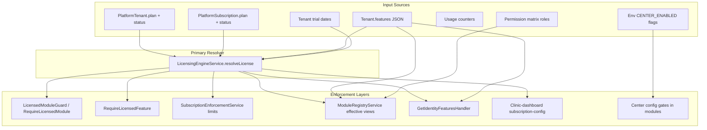

# Super Admin v4 Step 01 Supplement — Healthcare Catalog and Entitlement Discovery

**Document type:** Discovery supplement (Step 01)  
**Release:** **47** — Flexible Super Admin MVP  
**Authoritative playbook:** Super Admin Flexible Plans and Entitlements Implementation Playbook v4  
**Baseline document:** [`docs/Architecture_Discovery_Report.md`](./Architecture_Discovery_Report.md)  
**Date:** 2026-07-21  
**Status:** **DISCOVERY COMPLETE** — no implementation authorized by this document  
**Method:** Repository evidence inspection only  

---

## 1. Executive Summary

This supplement extends the generic Step 01 architecture discovery with evidence focused on **commercial catalog, subscription, licensing, entitlement, facility type, specialty, module, feature, limit, and enforcement** representations in the current Healthcare ERP monorepo.

**Verified high-level state:**

| Area | Status | v4 implication |
|------|--------|----------------|
| SaaS plan / subscription / license runtime | **Existing** (partial SSOT) | Extend `LicensingEngineService` and platform-admin; do not rebuild |
| Immutable plan versions, add-ons, compatibility rules | **Missing** | New domain required under v4 |
| Facility type | **Partial** (JSON in `tenant.features.clinicProfile`) | Requires terminology freeze and possible typed model |
| Medical specialty | **Partial** (free-text JSON + UI labels) | Not a first-class catalog; collides with modules/departments |
| ERP module / feature control | **Existing** (config + guards + registry) | Reuse `LicensedModuleId`, `@booking/module-registry` |
| Limits / quotas | **Existing** (fragmented across configs) | Consolidate under future effective-entitlement resolver |
| Dedicated Super Admin app | **Missing** | Control-plane UI embedded in clinic-dashboard today |
| Central entitlement resolver | **Partial** | `LicensingEngineService` exists but is not the only decision path |
| Feature flags vs commercial entitlements | **Mixed** | Env center flags, `tenant.features`, and license checks overlap |

**Critical finding:** The repository implements a **mature but fragmented** licensing stack with **three coexisting plan vocabularies** (Prisma `LITE|PRO|ENTERPRISE`, platform-admin `starter|growth|enterprise`, subscription/UI `starter|professional|business|enterprise`). There is **no** v4-style immutable plan catalog, plan version, add-on, or explainable effective-entitlement SSOT yet.

This document is **discovery only**. No code, schema, migrations, or enforcement changes were made.

---

## 2. Relationship to the Existing Architecture Discovery Report

[`docs/Architecture_Discovery_Report.md`](./Architecture_Discovery_Report.md) remains the authoritative baseline for:

- Monorepo layout (`apps/api`, `apps/clinic-dashboard`, `apps/patient-portal`; no `apps/super-admin`)
- Technology stack (NestJS, Prisma, React/Vite, npm workspaces)
- Authentication, tenant isolation, RBAC patterns
- Existing Centers through Release 46
- Verified `platform-admin` bounded context and embedded super-admin UX in clinic-dashboard

**This supplement adds only v4-specific findings** and does not repeat generic discovery unless directly relevant to catalog/entitlement behavior.

**Doc vs repo note (from baseline, still relevant):**

| Claim | Source | Repository evidence |
|-------|--------|---------------------|
| Dedicated Super Admin app exists | `docs/MONOREPO.md` proposed layout | **Absent** — `apps/super-admin` not found |
| Phase 47 SSOT documents | Expected for Release 47 | **Missing** — no `docs/*PHASE_47*` / frozen OD for Super Admin v4 |

---

## 3. Repository Evidence Reviewed

### Core API modules

| Path | Purpose |
|------|---------|
| `apps/api/src/modules/platform-admin/` | SaaS control-plane: tenant lifecycle, plan change, privileged access |
| `apps/api/src/modules/subscription/` | Licensing engine, enforcement, tenant subscription APIs |
| `apps/api/src/modules/module-registry/` | Effective module views combining license + RBAC + tenant flags |
| `apps/api/src/modules/settings/` | Tenant settings including `clinicProfile`, `moduleFlags`, `branding` |
| `apps/api/src/modules/identity/application/handlers/get-identity-features.handler.ts` | Frontend feature map merge |
| `apps/api/src/modules/tenant/application/handlers/create-tenant.handler.ts` | Tenant identity creation (no platform link) |
| `apps/api/src/modules/integrations/` | Gateway quotas (separate from SaaS plan limits) |
| `apps/api/src/modules/ai/domain/config/ai-plan-limits.config.ts` | AI-specific plan limits |

### Shared packages

| Path | Purpose |
|------|---------|
| `packages/module-registry/` | Built-in module manifests, effective module resolver |
| `packages/permissions/` | Permission evaluation helpers (consumed by clinic-dashboard) |

### Configuration and schema

| Path | Purpose |
|------|---------|
| `apps/api/prisma/schema.prisma` | `Tenant`, `PlatformTenant`, `PlatformSubscription`, `ClinicSubscription`, licensing audit tables |
| `apps/api/config/permission-matrix.json` | RBAC resources including `api.platform_admin`, `api.subscription` |
| `apps/api/src/modules/subscription/domain/config/licensing.config.ts` | Licensed modules and features matrix |
| `apps/api/src/modules/subscription/domain/config/plan-limits.config.ts` | Numeric limits and backend feature flags |
| `apps/api/src/modules/subscription/domain/config/plan-name.mapper.ts` | Plan vocabulary mapping and business-tier limits |
| `apps/api/src/modules/platform-admin/domain/value-objects/entitlement-plan.ts` | Platform-admin plan normalization |
| `apps/api/.env.example` | Center feature-flag env vars |

### Clinic-dashboard (operator UI)

| Path | Purpose |
|------|---------|
| `apps/clinic-dashboard/src/features/subscription/` | Subscription admin, plan comparison, platform tenant management |
| `apps/clinic-dashboard/src/features/settings/pages/ClinicProfilePage.tsx` | Facility type and specialty UI |
| `apps/clinic-dashboard/src/i18n/settings-messages.ts` | Clinic type and specialty option labels |

### Tests inspected (read-only)

| Path | Coverage area |
|------|---------------|
| `apps/api/src/modules/subscription/tests/licensing-engine.service.spec.ts` | License resolution, business tier |
| `apps/api/src/modules/subscription/tests/subscription-enforcement.service.spec.ts` | Limit enforcement |
| `apps/api/src/modules/subscription/tests/licensing-commercial-audit.service.spec.ts` | Commercial audit events |
| `apps/api/src/modules/subscription/tests/licensing-execution.guard.spec.ts` | Worker licensing guard |
| `apps/api/src/modules/subscription/tests/licensed-feature-enforcement.integration.spec.ts` | Feature guard integration |
| `apps/api/src/modules/platform-admin/tests/platform-admin-permission.guard.spec.ts` | Platform admin guard |
| `apps/api/src/modules/module-registry/tests/module-registry.service.spec.ts` | Module flags + license merge |
| `apps/api/prisma/seed-licensing-e2e.mjs` | E2E licensing fixtures |
| `.github/workflows/phase28-licensing-ci.yml` | Licensing CI workflow |

---

## 4. Current Commercial and Licensing Architecture

### 4.1 Plan vocabulary (verified collision)

The repository maintains **three plan namespaces** that must be mapped explicitly in v4 Step 02:

| Layer | Values | Evidence |
|-------|--------|----------|
| Prisma enum | `LITE`, `PRO`, `ENTERPRISE` | `apps/api/prisma/schema.prisma` — `enum EntitlementPlan` |
| Platform-admin domain | `starter`, `growth`, `enterprise` | `apps/api/src/modules/platform-admin/domain/value-objects/entitlement-plan.ts` — `ENTITLEMENT_PLANS`, `normalizeEntitlementPlan` |
| Subscription backend | `lite`, `pro`, `enterprise` | `apps/api/src/modules/subscription/domain/config/plan-limits.config.ts` — `PLAN_LIMITS` |
| UI / dashboard | `starter`, `professional`, `business`, `enterprise` | `apps/api/src/modules/subscription/domain/config/plan-name.mapper.ts` — `UiSubscriptionPlan`, `TENANT_SUBSCRIPTION_PLANS` |

**Finding:** `business` is a **UI tier** mapped to backend `pro` with **distinct limit overrides** via `getLimitsForUiPlan`.

**Evidence:**
- `apps/api/src/modules/subscription/domain/config/plan-name.mapper.ts` — `UI_TO_SUBSCRIPTION`, `getLimitsForUiPlan`, `BUSINESS_LIMITS`
- `apps/api/src/modules/platform-admin/domain/value-objects/entitlement-plan.vo.ts` — platform limits (`starter`: 1 branch / 10 users; `growth`: 5 / 50; `enterprise`: unlimited)

**Status:** Verified  
**Impact:** v4 must freeze terminology and document explicit mapping; direct replacement without a bridge would break plan change, UI catalog, and enforcement.

---

### 4.2 Core entities and SoR

| Component | Symbol / model | SoR | Maturity | v4 treatment |
|-----------|----------------|-----|----------|--------------|
| Tenant identity | `Tenant` | Prisma `tenants` | Existing | Reuse |
| Tenant feature JSON | `Tenant.features` JSONB | Prisma | Existing | Migration Bridge |
| Platform registration | `PlatformTenant` | Prisma `platform_tenants` | Existing | Extend |
| SaaS subscription row | `PlatformSubscription` | Prisma `platform_subscriptions` | Existing | Extend |
| Patient clinic packages | `ClinicSubscription` | Prisma `clinic_subscriptions` | Existing (different domain) | Keep Unchanged |
| License audit | `LicenseAuditEvent` | Prisma | Existing | Reuse |
| License lifecycle | `TenantLicenseLifecycleState`, `LicenseLifecycleTransition` | Prisma | Existing | Reuse |
| Runtime license object | `TenantLicense` | Computed by `LicensingEngineService` | Partial | Extend |
| Entitlements payload | `TenantEntitlementsPayload` | Computed | Partial | Extend |
| Plan catalog (static) | `LICENSED_MODULES`, `LICENSED_FEATURES`, `PLAN_LIMITS` | TypeScript config files | Existing | Adapter → future catalog |
| Platform plan VO | `EntitlementPlanVO` | In-memory domain | Existing | Bridge until catalog SSOT |

**Evidence:**
- `apps/api/prisma/schema.prisma` — models `Tenant`, `PlatformTenant`, `PlatformSubscription`, `ClinicSubscription`, `LicenseAuditEvent`
- `apps/api/src/modules/subscription/application/services/licensing-engine.service.ts` — class comment: "Central licensing engine — single source of truth for tenant entitlements"
- `apps/api/src/modules/subscription/domain/types/tenant-license.types.ts` — `TenantLicense`, `TenantEntitlementsPayload`

**Status:** Verified  
**Impact:** v4 should extend existing SoR; `ClinicSubscription` must not be conflated with SaaS billing.

---

### 4.3 Services, routes, and consumers

| Component | Path | Responsibility | Writers | Readers | Enforcement |
|-----------|------|----------------|---------|---------|-------------|
| `LicensingEngineService` | `subscription/application/services/licensing-engine.service.ts` | Resolve license, entitlements, limits, plan preview | N/A (computed) | Guards, handlers, module-registry, AI | Server-side |
| `SubscriptionEnforcementService` | `subscription/application/services/subscription-enforcement.service.ts` | Facade for limit enforcement | N/A | Import adapters, settings, media | Server-side |
| `PlatformAdminController` | `platform-admin/api/platform-admin.controller.ts` | `/platform/tenants*` lifecycle + plan | Handlers | Clinic-dashboard super-admin UI | RBAC `api.platform_admin` |
| `TenantSubscriptionController` | `subscription/api/tenant-subscription.controller.ts` | `/tenant/subscription/*`, platform entitlement grants | Handlers | Clinic-dashboard subscription pages | RBAC + licensing |
| `ChangePlatformTenantPlanHandler` | `platform-admin/application/handlers/change-platform-tenant-plan.handler.ts` | Operator plan change | `PlatformTenant.plan` | Event bus → licensing audit listener | Audit only |
| `ChangeTenantSubscriptionPlanHandler` | `subscription/application/handlers/tenant-subscription.handlers.ts` | Tenant-initiated plan change + `subscriptionUiPlan` | `Tenant.features`, `PlatformSubscription` | Licensing cache invalidation | Full stack update |
| `LicensingCommercialAuditListener` | `subscription/application/listeners/licensing-commercial-audit.listener.ts` | Audit + cache invalidation on platform events | `LicenseAuditEvent` | Observability | Event-driven |

**Key APIs (verified from permission matrix and controllers):**

| Method | Route | Controller | Authorization |
|--------|-------|------------|---------------|
| POST | `/platform/tenants` | `PlatformAdminController.provision` | `api.platform_admin` create |
| PATCH | `/platform/tenants/:id/plan` | `PlatformAdminController` | `api.platform_admin` manage |
| GET | `/tenant/subscription` | `TenantSubscriptionController` | `api.subscription` view |
| GET | `/tenant/subscription/entitlements` | `TenantSubscriptionController` | `api.subscription` view |
| PATCH | `/tenant/subscription/platform-tenants/:id/entitlements` | `TenantSubscriptionController.grantEntitlements` | `api.platform_admin` manage |
| POST | `/tenant/subscription/platform-tenants/:id/trial` | `TenantSubscriptionController.grantTrial` | `api.platform_admin` manage |

**Evidence:**
- `apps/api/config/permission-matrix.json` — resource `api.platform_admin`, operations list
- `apps/api/src/modules/subscription/api/tenant-subscription.controller.ts`

**Status:** Verified  
**Impact:** Future Super Admin facade should expose/consume these APIs rather than duplicate SoR.

---

### 4.4 Tenant feature JSON structures (legacy bridge)

Verified keys inside `Tenant.features` JSONB:

| Key | Purpose | Evidence |
|-----|---------|----------|
| `subscriptionUiPlan` | UI tier override (`business` etc.) | `licensing-engine.service.ts` — `buildLicense`; `tenant-subscription.handlers.ts` |
| `clinicProfile` | Clinic metadata including `clinicType`, `specialties` | `settings.service.ts`, `update-tenant-settings.dto.ts` |
| `moduleFlags` | Per-module tenant enable/disable overrides | `settings.service.ts`, `module-registry.service.ts` |
| `branding` | White-label tokens | `portal-branding-resolver.service.ts` |
| `grantHistory` | Commercial grant audit trail in JSON | `subscription-grant-history.util.ts` |
| Generic boolean flags | Merged into identity features | `get-identity-features.handler.ts` |

**Schema comment:** `Tenant.features` documented as "Feature flags JSONB" in Prisma.

**Evidence:** `apps/api/prisma/schema.prisma` — `Tenant.features`; handlers above.

**Status:** Verified  
**Impact:** High bridge risk — many readers/writers depend on JSON shape.

---

### 4.5 Trial, activation, expiration, suspension

| Concern | Representation | Evidence |
|---------|----------------|----------|
| Tenant trial dates | `Tenant.trialStartedAt`, `Tenant.trialEndsAt` | `schema.prisma` — `Tenant` |
| Platform trial | `PlatformTenant.trialEndsAt` | `schema.prisma` — `PlatformTenant` |
| Contract dates | `PlatformTenant.contractStartDate`, `contractEndDate` | `schema.prisma` |
| Platform status | `PlatformTenantStatus`: PROVISIONING, ACTIVE, SUSPENDED, ARCHIVED | `schema.prisma` |
| Tenant lifecycle | `TenantLifecycleStatus`: TRIAL, ACTIVE, SUSPENDED, ARCHIVED | `schema.prisma` |
| Subscription status | `SubscriptionStatus`: TRIAL, ACTIVE, SUSPENDED, EXPIRED, CANCELLED | `schema.prisma` |
| License status (runtime) | `active`, `trial`, `grace`, `suspended`, `cancelled`, `expired`, `provisioning` | `licensing.config.ts` — `LicenseStatus`; resolved in `licensing-engine.service.ts` — `resolveLicenseStatus` |
| Grace period | `DEFAULT_GRACE_PERIOD_DAYS = 7` | `licensing.config.ts` |
| Suspension enforcement | Platform SUSPENDED/ARCHIVED → license `suspended`, read-only | `licensing-engine.service.ts` — `resolveLicenseStatus`, `buildLicense` |

**Status:** Verified  
**Impact:** v4 lifecycle model must align with existing dual status tracks (platform vs tenant vs subscription).

---

## 5. Facility Type Findings

**Finding:** Facility type is **not** a first-class Prisma model or enum. It is stored as an optional string inside `tenant.features.clinicProfile.clinicType`.

**Allowed values (DTO validation only):** `'medical' | 'dental' | 'beauty' | 'multi'`

**Evidence:**
- `apps/api/src/modules/settings/application/dto/update-tenant-settings.dto.ts` — `clinicProfile.clinicType`
- `apps/api/src/modules/settings/application/services/settings.service.ts` — reads/writes `features.clinicProfile`
- `apps/clinic-dashboard/src/features/settings/pages/ClinicProfilePage.tsx` — UI selector
- `apps/clinic-dashboard/src/i18n/settings-messages.ts` — `clinicTypes: { medical, dental, beauty, multi }`

**Not found in repository evidence:**
- `facilityType`, `tenantType`, `organizationType`, `hospital`, `laboratory`, `pharmacy` as typed models or enums
- Server-side licensing or module gating based on `clinicType`
- Provisioning defaults differentiated by facility type

**Classification:** Partial — JSON field + UI only  
**Status:** Verified  
**Impact:** v4 "Facility Type" catalog is **Missing** as a commercial/licensing concept; current field is operational metadata only.

---

## 6. Medical Specialty Findings

### 6.1 Current representation

| Representation | Type | Evidence |
|----------------|------|----------|
| `clinicProfile.specialties?: string[]` | Free-text array in JSON | `update-tenant-settings.dto.ts` |
| UI specialty options | i18n labels only | `settings-messages.ts` — `specialtyOptions: { general, pediatrics, dermatology, orthodontics, cosmetic, physiotherapy }` |
| `Department` Prisma model | Org unit (name, branch scope) | `schema.prisma` — `model Department` |
| Clinical vertical modules | `dental`, `beauty` bounded contexts | `apps/api/src/modules/dental/`, `apps/api/src/modules/beauty/` |

**Not found:**
- Prisma `Specialty` model
- Specialty-driven licensing or provisioning
- API enum for specialty codes
- Relationship from specialty to plan entitlements

**Status:** Verified  
**Impact:** Specialty is presentation/config today; clinical verticals are **module-based**, not specialty-catalog-based.

---

### 6.2 Terminology collisions (see Terminology Collision Matrix)

Specialty terminology collides with:
- **Facility type** (`clinicType: 'dental'|'beauty'|'multi'`)
- **ERP modules** (`dental`, `beauty` modules)
- **Department** (organizational unit)
- **Practitioner roles** (`dentist`, `specialist` in permission matrix)
- **Service categories** (not verified as separate catalog)

---

## 7. Module and Feature Findings

### 7.1 Control mechanism taxonomy

| Mechanism | Identifier style | Purpose | Classification |
|-----------|------------------|---------|----------------|
| Licensed ERP module | `LicensedModuleId` (camelCase) | Commercial module access | Commercial entitlement |
| Licensed feature | `LicensedFeatureId` | Finer-grained capability / UI feature | Commercial entitlement |
| Backend plan feature | `PlanFeatures` keys (`aiModels`, `customWorkflows`, …) | Server feature gates | Commercial entitlement |
| Permission resource | `api.<domain>` in permission matrix | RBAC | User permission |
| Tenant `moduleFlags` | Module id → boolean | Tenant operational override | Tenant configuration |
| Env center flags | `*_CENTER_ENABLED` | Global operational dormancy | Operational feature flag |
| `tenant.features` booleans | Ad hoc keys | Mixed — merged into identity features | Unclear / mixed-purpose |

**Evidence:**
- `apps/api/src/modules/subscription/domain/config/licensing.config.ts` — `LICENSED_MODULES`, `LICENSED_FEATURES`
- `apps/api/config/permission-matrix.json` — resource IDs
- `apps/api/.env.example` — `PATIENT_PORTAL_CENTER_ENABLED`, `IMPORT_EXPORT_CENTER_ENABLED`, etc.
- `apps/api/src/modules/module-registry/application/module-registry.service.ts` — combines license modules + `moduleFlags` + RBAC

---

### 7.2 Verified module identifiers and enforcement locations

| Module ID | Min UI plan (config) | HTTP enforcement (sample) | Permission resource |
|-----------|----------------------|---------------------------|---------------------|
| `dashboard` | starter | `dashboard.controller.ts` — `@RequireLicensedModule('dashboard')` | `api.dashboard` (if present) |
| `patients` | starter | patients module | `api.patients` |
| `scheduling` | starter | scheduling controllers | `api.scheduling` |
| `emr` | professional | `encounter.controller.ts` | `api.emr` |
| `dental` | professional | `dental.controller.ts` | `api.dental` |
| `beauty` | professional | `beauty.controller.ts` | `api.beauty` |
| `billing` | starter | `billing.controller.ts` | `api.billing` |
| `inventory` | business | inventory module | `api.inventory` |
| `analytics` | business | analytics module | `api.analytics` |
| `workflow` | business | `workflow.controller.ts` | `api.workflow` |
| `patientPortal` | professional | patient-portal module | `api.patient_portal` |
| `ai` | starter (preview) | AI module | `api.ai` |

**Module registry package:** `packages/module-registry/src/builtin/builtin-manifests.ts` — manifests keyed by `LicensedModuleId`.

**Effective module resolution:** `resolveEffectiveModuleViews` applies license access, tenant `moduleFlags`, RBAC, dependency health.

**Evidence:**
- `licensing.config.ts` — `LICENSED_MODULES`
- `apps/api/src/modules/subscription/api/decorators/require-licensed-module.decorator.ts`
- `apps/api/src/modules/subscription/api/guards/licensed-module.guard.ts`
- `packages/module-registry/src/resolver/effective-module-resolver.ts`

**Status:** Verified  
**Impact:** Strong reuse candidate for v4 stable capability keys at the **module** layer.

---

### 7.3 Frontend navigation gating

Clinic-dashboard duplicates plan/feature matrices:

- `apps/clinic-dashboard/src/features/subscription/config/subscription-config.ts` — `PLAN_CATALOG`, `FEATURE_MATRIX`
- Access helpers: `canViewPlatformAdmin`, `useSubscriptionAccess()` — permission-based, not license-based for super-admin screens

**Evidence:** `subscription-config.ts`; `hooks/useSubscription.ts` — `hasPermission(roles, 'api.platform_admin', 'view')`

**Status:** Verified  
**Impact:** UI catalog is a **third copy** of commercial rules (alongside API config files) — drift risk for v4.

---

## 8. Limits and Quotas Findings

### 8.1 SaaS plan limits

| Limit key | Default (lite/starter) | Storage | Enforcement | Status |
|-----------|------------------------|---------|-------------|--------|
| `maxUsers` | 10 | `plan-limits.config.ts`; also `EntitlementPlanVO` (platform) | `enforceUserLimit` — hard | Verified |
| `maxDoctors` | 3 | `plan-limits.config.ts` | `enforceDoctorLimit` — hard | Verified |
| `maxBranches` | 1 | `plan-limits.config.ts`; `PlatformTenant.maxBranches` | `enforceBranchLimit` in settings branch create — hard | Verified |
| `maxPatients` | 1,000 | `plan-limits.config.ts` | `enforcePatientLimit` — hard | Verified |
| `maxAppointmentsPerMonth` | 500 | `plan-limits.config.ts` | Not verified from all write paths | Partially Verified |
| `maxReportsPerMonth` | 10 | `plan-limits.config.ts` | Not verified from all write paths | Partially Verified |
| `maxStorageGb` | 5 | `plan-limits.config.ts` | `enforceStorageLimit` — hard | Verified |
| `maxApiRequestsPerDay` | 1,000 | `plan-limits.config.ts` | Integration gateway separate | Partial |
| `maxEmail/Sms/Whatsapp/Push per month` | various | `plan-limits.config.ts` | `communication-dispatch.service.ts` — hard | Verified |

**Business tier override:** Separate limits in `plan-name.mapper.ts` — `BUSINESS_LIMITS`, `BUSINESS_COMMUNICATION`.

**Evidence:**
- `apps/api/src/modules/subscription/domain/config/plan-limits.config.ts`
- `apps/api/src/modules/subscription/application/services/subscription-enforcement.service.ts`
- `apps/api/src/modules/settings/application/services/settings.service.ts` — calls `enforceBranchLimit`
- `apps/api/src/modules/import-export/adapters/users-import.adapter.ts` — calls `enforceUserLimit`
- `apps/api/src/modules/subscription/tests/subscription-enforcement.service.spec.ts`

---

### 8.2 Non-SaaS quota systems (separate SoR)

| System | Model / config | Scope |
|--------|----------------|-------|
| AI quotas | `ai-plan-limits.config.ts`, `AiQuotaExceededException` | AI workspace, prompts, attachments |
| Integration gateway quotas | `IntegrationQuotaPolicy`, `IntegrationUsageCounter` | API gateway rate limits |
| Communication ledger | `CommunicationDispatchLedger` | Idempotent send counting |

**Evidence:** `schema.prisma` — `IntegrationQuotaPolicy`; `apps/api/src/modules/ai/domain/config/ai-plan-limits.config.ts`

**Status:** Verified  
**Impact:** v4 "Limit" concept spans multiple SoRs today; unified catalog must not assume single table.

---

### 8.3 Limit enforcement classification summary

| Classification | Examples |
|----------------|----------|
| Hard-enforced (server) | users, doctors, branches, patients, storage, comms channels |
| Soft-enforced / partial | appointments/month, reports/month — config exists; not all write paths verified |
| Advisory / display only | Clinic-dashboard `UsageMeter.tsx` — displays API usage data |
| Configured but unused | Not verified without exhaustive path tracing |
| Separate quota domain | Integration gateway, AI |

---

## 9. Hard-Coded Commercial Logic Inventory

### Hard-Coded Logic Matrix

| Path | Symbol or Pattern | Decision Type | Current Behavior | Risk | Future Migration Candidate |
|------|-------------------|---------------|------------------|------|----------------------------|
| `plan-name.mapper.ts` | `if (uiTier === 'business' && plan === 'pro')` | Plan tier | Maps pro → business UI tier | Drift vs catalog | Yes — effective entitlement |
| `plan-name.mapper.ts` | `getLimitsForUiPlan` — `uiPlan === 'business'` | Limit override | Applies BUSINESS_LIMITS | Hidden tier logic | Yes |
| `entitlement-plan.ts` | `ENTITLEMENT_PLAN_ALIASES` | Plan alias | Maps lite→starter, pro→growth, professional→growth, business→growth | Alias proliferation | Yes — legacy bridge |
| `plan-limits.config.ts` | `PLAN_NAME_ALIASES` — basic/standard/premium | Legacy plan names | Maps to lite/pro/enterprise | Migration residue | Bridge |
| `licensing-engine.service.ts` | `buildLicense` — reads `subscriptionUiPlan` | UI tier override | Changes effective limits/features | JSON override bypasses platform plan | Yes |
| `get-identity-features.handler.ts` | `{ ...result, ...tenantFeatures }` | Feature merge | Tenant JSON can override license booleans | **Security/consistency** — UI may show enabled features not server-enforced | Yes |
| `ai-plan-limits.config.ts` | `normalized === 'business'` | AI limits | Separate BUSINESS_AI tier | Parallel limit matrix | Yes |
| `ai-subscription.service.ts` | `license.uiPlan === 'business'` | Plan label | Error message tier selection | Low | Yes |
| `tenant-subscription.service.ts` | Ternary backendPlan → platform plan strings | Plan mapping | Inline mapping duplicate of mapper | Drift | Yes |
| `update-tenant-settings.dto.ts` | `clinicType?: 'medical' \| 'dental' \| 'beauty' \| 'multi'` | Facility type | Validation only; no licensing linkage | False sense of catalog | Step 02 decision |
| `prisma-patient.repository.ts` | `m.category === 'DENTAL_IMAGE'` | Media category | Clinical media routing | Not commercial | No |
| `licensing.config.ts` | Static `LICENSED_MODULES` / `LICENSED_FEATURES` | Entire commercial matrix | Hard-coded TS arrays | Cannot publish plans without deploy | Yes — plan version catalog |
| `subscription-config.ts` (FE) | Duplicated `PLAN_CATALOG`, `FEATURE_MATRIX` | UI commercial matrix | Parallel to backend | UI/API drift | Yes |
| `change-platform-tenant-plan.handler.ts` | Updates platform plan only | Plan change | Does not update `subscriptionUiPlan` or subscription row | Incomplete operator change path | Bridge gap |
| `licensing-commercial-audit.listener.ts` | `subscriptionPlanToUiPlan(event.previousPlan as 'lite'...)` | Event handling | Assumes platform event plans are subscription types | Type coercion risk | Yes |

**Not found (verified absent):**
- `tenantType`, `enabledModules`, `features.includes(...)` as commercial gate patterns
- Special-case tenant IDs or customer names in licensing paths

**Status:** Verified (for listed items)  
**Impact:** v4 effective entitlement resolver must subsume scattered plan/limit/feature decisions.

---

## 10. Current Entitlement Enforcement Map

### 10.1 Decision path diagram (verified)

### 10.2 Path details

| Stage | Input | Logic | Cache | Failure behavior | Tests |
|-------|-------|-------|-------|------------------|-------|
| License resolution | PlatformTenant, PlatformSubscription, Tenant.features | `buildLicense` + status resolver | In-memory 60s TTL per tenant | Defaults to lite if no platform tenant | `licensing-engine.service.spec.ts` |
| HTTP module access | JWT + tenant context | `LicensedModuleGuard` → `resolveLicense` | Uses license cache | 403 Forbidden | `licensed-feature-enforcement.integration.spec.ts` |
| HTTP feature access | Decorated routes | Feature state from license | Same | `PlanLimitExceededException` | Same |
| Limit enforcement | Usage snapshots | Compare to `effectiveLimits` | Usage from DB | Throws limit exceptions | `subscription-enforcement.service.spec.ts` |
| Module visibility | License modules + moduleFlags + RBAC | `resolveEffectiveModuleViews` | Bootstrap payload version hash | Module hidden/disabled | `module-registry.service.spec.ts` |
| Identity features API | License + tenant.features merge | Spread merge — **tenant overrides license** | None | Returns booleans to UI | Not verified for override safety |
| Platform lifecycle | Suspend/resume/archive events | Listener updates audit + invalidates cache | Invalidated on event | Suspended → read-only license | `licensing-commercial-audit.service.spec.ts` |
| Plan change (operator) | PATCH platform plan | Updates PlatformTenant; event → cache invalidate | Invalidated | Does not sync subscriptionUiPlan automatically | Partial |
| Plan change (tenant) | POST tenant/subscription/plan-change | Updates platform + subscription row + subscriptionUiPlan | Invalidated | Full stack | Handler code verified |
| Center modules | Env flag | Throws if center disabled | N/A | 400 Bad Request | Center-specific specs |
| Worker/background | LicensingExecutionGuard | License check before job | Same cache | Job skipped/failed | `licensing-execution.guard.spec.ts` |

**Finding:** Repository has **one primary resolver** (`LicensingEngineService`) but **multiple downstream enforcement paths** with inconsistent inputs (especially `GetIdentityFeaturesHandler` and frontend matrices).

**Status:** Verified  
**Impact:** v4 must define a single explainable effective entitlement with explicit override rules.

---

## 11. Feature Flags vs Entitlements

### 11.1 Operational feature flags (env-scoped)

| Flag | Module | Usage |
|------|--------|-------|
| `PATIENT_PORTAL_CENTER_ENABLED` | Patient Portal | Center dormancy / health probes |
| `IMPORT_EXPORT_CENTER_ENABLED` | Import/Export | Blocks executor when false |
| `BACKUP_RESTORE_CENTER_ENABLED` | Backup/Restore | Blocks backup/verification |
| `API_KEYS_INTEGRATIONS_CENTER_ENABLED` | Integrations | Credential engine gate |

**Evidence:** `apps/api/.env.example`; module config files; `platform-health-aggregator.service.ts`

**Classification:** Operational rollout / kill switch — **not** per-tenant commercial entitlements.

---

### 11.2 Tenant-scoped flags (JSON)

| Mechanism | Purpose | Commercial? |
|-----------|---------|-------------|
| `tenant.features.moduleFlags` | Disable modules regardless of license | Mixed — behaves like operational override |
| `tenant.features.subscriptionUiPlan` | UI tier override affecting limits | **Commercial** |
| `tenant.features` generic booleans | Merged into identity features | Mixed — can override license |
| `Tenant.features` schema comment | "Feature flags JSONB" | Terminology collision |

---

### 11.3 Mixing points (gaps for v4)

1. **`GetIdentityFeaturesHandler`** spreads raw `tenant.features` over license-derived booleans — commercial and operational flags not separated.
2. **`moduleFlags`** can disable a licensed module in module-registry without changing subscription — useful operationally but not auditable as commercial change.
3. **Center env flags** gate entire product areas globally — independent of tenant plan.
4. **Frontend `FEATURE_MATRIX`** treats features as commercial without server-side feature guard on all routes.

**Status:** Verified  
**Impact:** Step 02 must define strict boundary: entitlement (contractual) vs feature flag (operational).

---

## 12. Tenant Provisioning and Lifecycle Integration

### 12.1 Verified flows

| Step | Handler | Creates / updates | Idempotent? | Plan defaults |
|------|---------|-------------------|-------------|---------------|
| Tenant identity | `CreateTenantHandler` | `Tenant` row only | No duplicate domain check beyond slug/domain | None |
| Platform registration | `ProvisionPlatformTenantHandler` | `PlatformTenant` (status PROVISIONING) | Conflict if tenant already registered | From command `plan` |
| Activation | `ActivatePlatformTenantHandler` | Status → ACTIVE | State machine guarded | N/A |
| Suspension | `SuspendPlatformTenantHandler` | Status → SUSPENDED | Event + audit | Overrides runtime entitlements |
| Resume | `ResumePlatformTenantHandler` | Status → ACTIVE | Cache invalidate | N/A |
| Archive | `ArchivePlatformTenantHandler` | Status → ARCHIVED | License cancelled | N/A |
| Operator plan change | `ChangePlatformTenantPlanHandler` | `PlatformTenant.plan` | No-op if same plan | Normalized via `normalizeEntitlementPlan` |
| Tenant plan change | `ChangeTenantSubscriptionPlanHandler` | Platform + subscription + features | Updates grant history | Resolves via `tenantSubscriptionService.resolveRequestedPlan` |
| Trial grant | `GrantTenantTrialHandler` (via controller) | Platform/subscription/features | Not fully traced in this discovery | Operator-provided |

**Evidence:**
- `create-tenant.handler.ts` — no platform link
- `provision-platform-tenant.handler.ts` — requires existing `tenantId`
- `platform-tenant.entity.ts` — default status provisioning
- `tenant-subscription.handlers.ts` — grant/trial/plan-change handlers

**Gaps:**
- No single orchestrated "create tenant + platform + subscription + default features" workflow verified
- No facility-type-based provisioning defaults
- `ChangePlatformTenantPlanHandler` does **not** update `PlatformSubscription` or `subscriptionUiPlan` (unlike tenant-initiated handler)
- Partial failure recovery across two-step provisioning not verified

**Status:** Verified (flows listed); partial failure recovery — Not verified from repository evidence  
**Impact:** v4 Super Admin provisioning should orchestrate existing handlers/repositories.

---

## 13. Existing Platform Admin Reuse Map

### 13.1 Backend (reuse directly)

| Capability | API | Handler | Audit |
|------------|-----|---------|-------|
| List/get platform tenants | GET `/platform/tenants`, `/:id` | `ListPlatformTenantsHandler`, `GetPlatformTenantHandler` | N/A |
| Provision tenant on platform | POST `/platform/tenants` | `ProvisionPlatformTenantHandler` | `platform_admin.tenant.provisioned` |
| Activate / suspend / resume / archive | POST lifecycle routes | respective handlers | lifecycle audit actions |
| Change plan | PATCH `/:id/plan` | `ChangePlatformTenantPlanHandler` | `platform_admin.tenant.plan_changed` |
| Privileged access grants | POST privileged-access/* | request/approve/reject/revoke handlers | privileged access audit |
| Grant entitlements / trial | PATCH/POST under `/tenant/subscription/platform-tenants/*` | `tenant-subscription.handlers.ts` | commercial audit service |

**Guard:** `PlatformAdminPermissionGuard` + `@RequirePermission('api.platform_admin', ...)`

**Evidence:** `platform-admin.controller.ts`; `permission-matrix.json` — `api.platform_admin` restricted to `super_admin` role only for all actions.

---

### 13.2 Frontend (embedded super-admin — adapt/extend)

| UI | Path | Gate |
|----|------|------|
| Platform tenant admin table | `SubscriptionAdminPage.tsx` | `api.platform_admin` view |
| Plan change, suspend, resume, activate | hooks in `useSubscription.ts` | manage/approve permissions |
| Grant trial / entitlements modals | `GrantTenantTrialModal`, `TenantEntitlementModal` | manage |
| Plan comparison / tenant subscription | `SubscriptionPlansPage`, `SubscriptionDashboardPage` | `api.subscription` |

**Evidence:** `apps/clinic-dashboard/src/features/subscription/pages/SubscriptionAdminPage.tsx`

---

### 13.3 Classification for v4

| Behavior | Treatment |
|----------|-----------|
| `platform-admin` APIs and repositories | **Reuse** as SoR |
| Licensing engine + audit | **Extend** |
| Clinic-dashboard super-admin slice | **Adapter** — expose via future Super Admin facade or expand |
| `super_admin` role universal access | **Requires Decision** — separation of duty |
| Privileged access workflow | **Keep Unchanged** |
| Patient `ClinicSubscription` module | **Keep Unchanged** — different bounded context |

---

## 14. RBAC and Separation-of-Duty Gaps

### 14.1 Existing platform permissions

Resource `api.platform_admin` — **all actions restricted to `super_admin` only** (no separation between view vs manage vs approve at role level beyond action granularity).

Resource `api.subscription` — broader roles (`owner`, `general_manager`, etc.) for tenant-scoped subscription viewing; plan change requires `manage` (`super_admin`, `owner`).

**Evidence:** `apps/api/config/permission-matrix.json`

---

### 14.2 Future v4 concepts — permission status

| Future concept | Existing permission? | Evidence |
|----------------|---------------------|----------|
| Catalog viewing/management | **Missing** | No `api.catalog` resource |
| Specialty management | **Missing** as catalog | Settings update only |
| Module management | **Partial** | `moduleFlags` via settings; registry read APIs |
| Plan creation/publishing/versioning | **Missing** | Plans are code config |
| Subscription assignment | **Partial** | `api.platform_admin` manage + subscription handlers |
| Subscription migration | **Missing** | No migration API |
| Add-on management | **Missing** | No add-on model |
| Tenant override approval | **Missing** | JSON overrides without approval workflow |
| Entitlement explanation | **Missing** | No explain API (license object is partial) |
| Entitlement cache invalidation | **Missing** as permission | Internal service method only |
| Audit viewing | **Partial** | Platform audit log port; not unified commercial audit UI |
| Sales ownership | **Missing** | Not verified |
| Trial creation | **Partial** | POST trial endpoint; `super_admin` manage |

**Overpowered role concern:** `super_admin` inherits broad access across nearly all resources in permission matrix, not only platform-admin.

**Status:** Verified  
**Impact:** Step 02 must define SoD model; Step 03+ must add granular permissions without breaking existing guards.

---

## 15. Current Data Model vs v4 Terminology

| v4 Concept | Repository state | Classification |
|------------|------------------|----------------|
| Facility Type | JSON `clinicProfile.clinicType` (4 values) | Partial — JSON only |
| Specialty | JSON `clinicProfile.specialties[]` + i18n labels | Partial — not SSOT catalog |
| Module | `LicensedModuleId` + module-registry manifests | Existing and reusable |
| Feature | `LicensedFeatureId` + `PlanFeatures` | Existing — hard-coded config |
| Limit | `PlanLimits` + platform `maxUsers/maxBranches` + AI/integration quotas | Partial — fragmented |
| Compatibility Rule | Not found | Missing |
| Plan | Static configs + Prisma enum | Partial — not publishable |
| Plan Version | Not found | Missing |
| Plan Entitlement | Implicit in `LICENSED_*` arrays | Hard-coded |
| Add-on | Not found (docs mention future) | Missing |
| Subscription | `PlatformSubscription` (SaaS) + `ClinicSubscription` (patient) | Existing but semantically dual |
| Tenant Override | `moduleFlags`, `subscriptionUiPlan`, generic `features` | Represented only in JSON |
| Effective Entitlement | `LicensingEngineService` computed object | Partial — not persisted/explainable |
| Feature Flag | Env center flags + `Tenant.features` | Mixed |
| License | No `License` table; runtime `TenantLicense` | Partial |

---

## 16. Legacy Licensing Bridge Inventory

### Legacy Bridge Matrix

| Legacy Source | Current Consumers | Current Contract | Replacement Risk | Bridge Requirement | Must Remain Passing |
|---------------|-------------------|------------------|------------------|--------------------|---------------------|
| `Tenant.features` JSONB | settings, licensing, identity, branding, integrations | Ad hoc keys | **High** | Read/write adapter for v4 overrides | All tenant settings tests |
| `subscriptionUiPlan` in features | `LicensingEngineService.buildLicense`, seed fixtures | UI tier string | **High** | Map to plan version or UI tier grant | `licensing-engine.service.spec.ts` |
| Plan alias maps (3 files) | platform-admin, subscription, AI | String aliases | **High** | Legacy alias resolver | `entitlement-plan.spec.ts`, mapper tests |
| `LICENSED_MODULES` / `LICENSED_FEATURES` TS config | Guards, engine, FE matrix | Static arrays | **High** | Import from published catalog snapshot | licensing + guard specs |
| `PlatformTenant.plan` enum | Platform admin, licensing | LITE/PRO/ENTERPRISE | Medium | Map to catalog plan version | platform-admin handlers |
| `EntitlementPlanVO` limits | Platform tenant entity | 2-limit subset | Medium | Extend or deprecate carefully | platform repository |
| `ClinicSubscription` | Patient subscription API | Separate domain | **Critical if confused** | Keep isolated | patient subscription tests |
| `grantHistory` in features JSON | Commercial audit trail | JSON array | Medium | Migrate to audit SoR | grant history util spec |
| Frontend `PLAN_CATALOG` | Clinic-dashboard UI | Duplicated limits | Medium | Fetch from API entitlements | FE subscription specs |
| `GetIdentityFeaturesHandler` merge | Frontend feature gates | boolean map | **High** | Define override precedence | Not verified |

---

## 17. Stable Capability Key Readiness

### 17.1 Existing conventions

| Registry | Key pattern | Example | Package/path |
|----------|-------------|---------|--------------|
| Licensed modules | camelCase id | `patientPortal`, `userManagement` | `licensing.config.ts` |
| Licensed features | camelCase id | `aiChat`, `whiteLabel` | `licensing.config.ts` |
| Permission resources | dot notation | `api.patient_portal`, `api.platform_admin` | `permission-matrix.json` |
| Module manifests | matches `LicensedModuleId` | `dental`, `beauty` | `packages/module-registry` |
| Backend plan features | camelCase | `customWorkflows`, `auditExport` | `plan-limits.config.ts` |
| i18n keys | dot path | `settings.profile.specialtyOptions.dermatology` | `settings-messages.ts` |

### 17.2 v4 example key readiness

| Conceptual v4 key | Ready? | Notes |
|-------------------|--------|-------|
| `facility_type.dental_clinic` | **No** | No dot-prefix convention; clinicType uses `dental` not `dental_clinic` |
| `specialty.dentistry` | **No** | Free-text only |
| `module.dental_emr` | **Partial** | Module id is `dental`, not `dental_emr` |
| `feature.advanced_reports` | **Partial** | Closest: `reports`, `advancedAnalytics` |
| `limit.max_users` | **No** | Code uses `maxUsers` camelCase |

**Naming conflicts:**
- `dental` = clinicType value, module id, role name (`dentist`), media category
- `subscription` = SaaS billing vs patient clinic packages
- `features` = tenant JSON column vs licensed features vs plan feature flags

**Status:** Verified  
**Impact:** Step 02 terminology freeze must choose canonical key namespace and migration from camelCase ids.

---

## 18. Source of Record Matrix

| Domain | Current SoR | Writers | Readers | Duplicate Representation | v4 Treatment |
|--------|---------------|---------|---------|------------------------|--------------|
| Tenant | Prisma `Tenant` | tenant module, settings | All modules | None for identity | Reuse |
| Facility type | `Tenant.features.clinicProfile.clinicType` | settings service | settings UI, profile pages | UI i18n labels | Requires Decision |
| Specialty | `Tenant.features.clinicProfile.specialties[]` | settings service | settings UI | i18n option list | New Domain Required |
| Module | `@booking/module-registry` manifests + `LicensedModuleId` | code deploy | registry, guards | FE route catalog | Extend |
| Feature | `licensing.config.ts` + `PlanFeatures` | code deploy | guards, identity handler | FE `FEATURE_MATRIX` | Adapter |
| Limit | `plan-limits.config.ts`, `EntitlementPlanVO`, AI/integration configs | code deploy | enforcement services | FE `PLAN_CATALOG`, platform tenant columns | Extend |
| Plan | Static TS + Prisma enum | code deploy / platform handlers | licensing engine | 3 vocabularies | New Domain Required |
| Subscription | `PlatformSubscription` | subscription handlers | licensing engine | None at row level | Extend |
| License (runtime) | `LicensingEngineService` | computed | guards, UI, registry | `TenantLicenseLifecycleState` | Extend |
| Entitlement (effective) | Computed in licensing engine | N/A | module-registry, UI | Partial overlap with identity merge | New Domain Required |
| Feature flag (operational) | Env vars + `Tenant.features` | ops / settings | center configs, identity | Mixed with commercial | Requires Decision |
| Provisioning state | `PlatformTenant.status` | platform-admin handlers | licensing status resolver | `Tenant.lifecycleStatus` | Extend |
| Platform user | `User` + roles | identity/auth | guards | None | Keep Unchanged |
| Sales ownership | Not found | — | — | — | Requires Decision |

---

## 19. Reuse / Extend / Adapter / New Domain Classification

| Area | Classification | Rationale |
|------|----------------|-----------|
| `platform-admin` bounded context | **Reuse** | Mature SoR for tenant lifecycle |
| `LicensingEngineService` | **Extend** | Already central; add explainability + catalog inputs |
| `PlatformTenant` / `PlatformSubscription` | **Extend** | Link to future plan versions |
| Plan alias mappers | **Migration Bridge** | Required during vocabulary transition |
| `Tenant.features` JSON | **Migration Bridge** | Until overrides modeled explicitly |
| `LICENSED_*` static config | **Adapter** | Initial catalog seed source |
| `@booking/module-registry` | **Reuse** | Effective module resolution |
| Clinic-dashboard super-admin UI | **Adapter** | Temporary control plane |
| Facility type JSON field | **Requires Decision** | Promote to catalog or keep metadata |
| Specialty free-text | **New Domain Required** | If v4 specialty catalog is in scope |
| Plan version / publish workflow | **New Domain Required** | Core v4 gap |
| Add-ons | **New Domain Required** | Not present |
| Compatibility rules | **New Domain Required** | Not present |
| Effective entitlement explain API | **New Domain Required** | Computed only today |
| Dedicated `apps/super-admin` | **Requires Decision** | Missing; may facade existing APIs |
| `ClinicSubscription` (patient) | **Keep Unchanged** | Separate bounded context |
| Center env flags | **Keep Unchanged** | Operational, not commercial |

---

## 20. Risks

| Risk | Evidence | Severity |
|------|----------|----------|
| Plan vocabulary drift breaks enforcement | 3 namespaces + FE copy | **High** |
| `GetIdentityFeaturesHandler` tenant JSON overrides license | `get-identity-features.handler.ts` spread merge | **High** |
| Operator plan change incomplete vs tenant plan change | `ChangePlatformTenantPlanHandler` vs `ChangeTenantSubscriptionPlanHandler` | **Medium** |
| UI-only commercial matrix drift | `subscription-config.ts` duplicates backend | **Medium** |
| `super_admin` overpowered — no SoD | `permission-matrix.json` | **Medium** |
| Facility type / specialty confused with modules | clinicType `dental` vs module `dental` | **Medium** |
| `ClinicSubscription` vs SaaS subscription naming collision | schema models | **Medium** |
| Cache staleness (60s TTL) after direct DB edits | `LicensingEngineService` cache | **Low** |
| No immutable published plans — deploy required for matrix changes | static TS config | **High** for v4 goals |

---

## 21. Unknowns

| Unknown | Status |
|---------|--------|
| Production cloud deployment topology for licensing | Not verified from repository evidence |
| Whether all appointment/report limit write paths enforce quotas | Not verified from repository evidence |
| External billing provider integration (Phase 2 hooks on PlatformSubscription) | Partial — schema fields exist; integration not verified |
| Sales ownership / CRM linkage for tenants | Not verified from repository evidence |
| Whether RLS policies cover `platform_tenants` cross-tenant reads | Not verified from repository evidence |
| Full list of routes lacking `@RequireLicensedFeature` parity | Not verified from repository evidence |
| Runtime behavior when platform tenant missing but tenant exists | Partial — licensing defaults to lite |

---

## 22. Questions for Step 02

1. **Canonical plan taxonomy:** Adopt v4 catalog plan ids or preserve `starter|professional|business|enterprise` UI tiers?
2. **Facility type scope:** Is `clinicType` operational metadata only, or a first-class v4 catalog entity driving compatibility?
3. **Specialty catalog scope:** Free-text vs controlled catalog — relationship to modules (`dental`, `beauty`)?
4. **Business tier:** Is `business` an add-on, a distinct plan version, or a UI-only limit profile on `pro`?
5. **Tenant override model:** How do `moduleFlags`, `subscriptionUiPlan`, and future tenant overrides relate hierarchically?
6. **Feature flag boundary:** Which keys in `Tenant.features` are operational vs commercial?
7. **Identity features merge:** Should tenant JSON ever override license booleans for client consumption?
8. **Super Admin app strategy:** Dedicated `apps/super-admin` vs expanded clinic-dashboard control plane?
9. **ClinicSubscription isolation:** Confirm it remains outside SaaS entitlement scope.
10. **Stable capability key namespace:** camelCase legacy vs dot-notation v4 examples in playbook?
11. **Sales / ownership:** Required for MVP or deferred?
12. **Compatibility rules:** Facility×specialty×module matrix in MVP or later phase?

---

## 23. Acceptance Criteria Evidence

| Criterion | Result |
|-----------|--------|
| No production code changed | **Passed** |
| No app/package scaffolded | **Passed** |
| No migration or schema change | **Passed** |
| No dependencies installed/updated | **Passed** |
| `docs/Architecture_Discovery_Report.md` preserved | **Passed** |
| Supplement document created | **Passed** |
| Facility type identified | **Passed** — JSON partial |
| Specialty identified | **Passed** — JSON partial |
| Module/feature control mapped | **Passed** |
| Limits classified by enforcement | **Passed** (with noted partials) |
| Plans/subscriptions/licenses/entitlements mapped | **Passed** |
| Feature flags vs commercial distinguished | **Passed** |
| Hard-coded checks inventoried | **Passed** |
| Enforcement paths traced | **Passed** |
| platform-admin reuse documented | **Passed** |
| Legacy bridge risks documented | **Passed** |
| Stable capability key readiness evaluated | **Passed** |
| Terminology conflicts listed | **Passed** |
| Material conclusions cite evidence | **Passed** |
| Unknowns marked | **Passed** |
| No implementation beyond classification | **Passed** |
| Recommends Step 02 | **Passed** |

---

## 24. Recommended Next Step

**Step 02 — Scope and Terminology Freeze**

Expected deliverable: `docs/SUPER_ADMIN_MVP_SCOPE.md`

Step 02 should resolve plan vocabulary, facility type vs specialty vs module boundaries, entitlement vs feature-flag separation, and MVP in/out scope before any catalog or resolver implementation.

---

## Required Matrices

### Capability Classification Matrix

| Concept | Existing Representation | Source of Record | Enforcement Location | Status | v4 Treatment |
|---------|-------------------------|------------------|----------------------|--------|--------------|
| Plan | Prisma `EntitlementPlan` + TS configs | Mixed — enum + code | `LicensingEngineService` | Partial | New Domain Required |
| Plan Version | None | — | — | Missing | New Domain Required |
| Subscription | `PlatformSubscription` | Prisma | Licensing engine input | Existing | Extend |
| License (runtime) | `TenantLicense` computed | LicensingEngineService | Guards, enforcement | Partial | Extend |
| Entitlement | `LICENSED_*` config + grants JSON | Code + Tenant.features | Engine + registry | Partial | New Domain Required |
| Module | `LicensedModuleId` + manifests | module-registry package | LicensedModuleGuard, registry | Existing | Reuse |
| Feature | `LicensedFeatureId`, `PlanFeatures` | licensing.config.ts | Feature guards, engine | Existing | Adapter |
| Facility Type | `clinicProfile.clinicType` | Tenant.features JSON | None | Partial | Requires Decision |
| Specialty | `clinicProfile.specialties[]` | Tenant.features JSON | None | Partial | New Domain Required |
| Limit | `PlanLimits`, platform maxUsers/maxBranches | Config + PlatformTenant | SubscriptionEnforcementService | Partial | Extend |
| Tenant Override | moduleFlags, subscriptionUiPlan | Tenant.features | Module registry, engine | Partial | Migration Bridge |
| Feature Flag (ops) | Env `*_CENTER_ENABLED` | Environment | Center module gates | Existing | Keep Unchanged |
| Compatibility Rule | None | — | — | Missing | New Domain Required |
| Add-on | None | — | — | Missing | New Domain Required |

### Terminology Collision Matrix

| Current Term | Current Meaning | Conflicting Meaning | Evidence | Decision Required in Step 02 |
|--------------|-----------------|---------------------|----------|------------------------------|
| `features` | Tenant JSONB column | Licensed features; plan feature flags | `schema.prisma` Tenant.features; `licensing.config.ts` | Yes — rename conceptually |
| `subscription` | SaaS PlatformSubscription | Patient ClinicSubscription | `schema.prisma` both models | Yes — naming in UI/API |
| `dental` | clinicType value | Module id; role `dentist` | settings DTO; `LicensedModuleId`; permission matrix | Yes |
| `beauty` | clinicType value | Module id (cosmetic) | settings; beauty module | Yes |
| `department` | Org unit model | Specialty / clinical department | `Department` model | Yes |
| `specialty` | Free-text profile tag | Module vertical; practitioner specialty | settings DTO vs modules | Yes |
| `plan` | 3+ vocabularies | Platform vs subscription vs UI | entitlement-plan.ts; plan-name.mapper.ts | Yes — critical |
| `business` | UI tier on pro backend | Standalone plan? | plan-name.mapper.ts | Yes |
| `entitlement` | Computed license grants | Future contractual entitlement | licensing engine | Yes |
| `feature flag` | Env center flag | Commercial feature toggle | .env.example vs Tenant.features | Yes |
| `license` | Runtime TenantLicense object | License table / legal document | tenant-license.types.ts | Yes |
| `tenantOverride` | White-label token tier | Future commercial override | module-registry whitelabel types | Yes |

---

*End of discovery supplement. Implementation of catalog, plan versions, subscriptions, entitlement resolver, or enforcement changes is explicitly out of scope for this step.*
